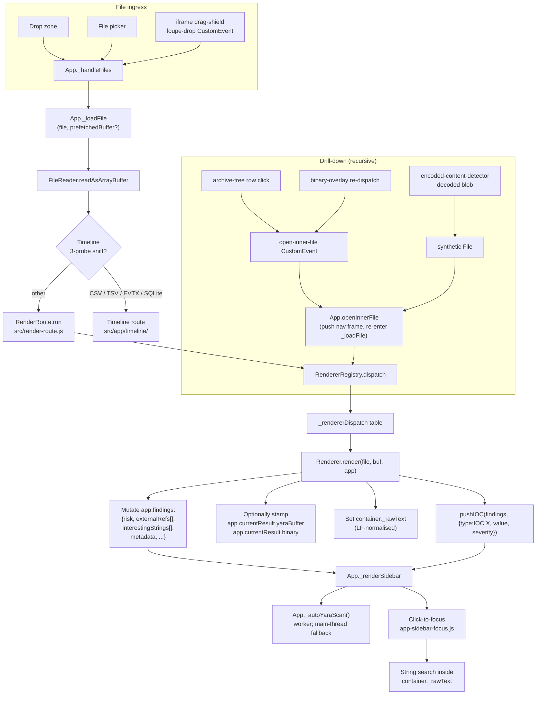
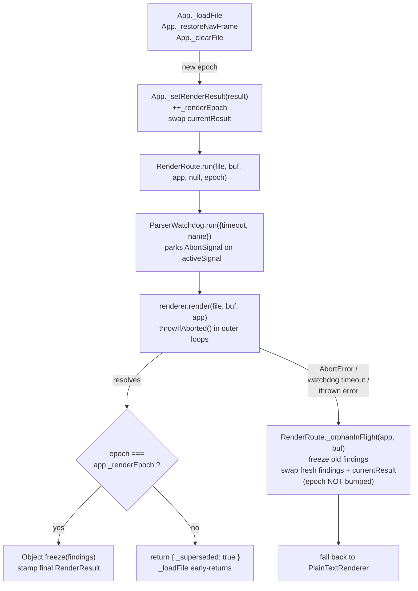

# Contributing to Loupe

> Developer guide.
> - End-user docs: [README.md](README.md)
> - Format / capability reference: [FEATURES.md](FEATURES.md)
> - Threat model & vulnerability reporting: [SECURITY.md](SECURITY.md)
> - Line-level index of every class, method, CSS section, and YARA rule: [CODEMAP.md](CODEMAP.md) (auto-generated)

---

## Footguns Cheat-Sheet

Every rule below is enforced by either a build gate (`scripts/build.py`,
`scripts/check_renderer_contract.py`, `scripts/check_regex_safety.py`) or
turns into a sidebar / runtime regression in the wild. **Read this list
before opening a PR.**

1. `docs/index.html` is a build artefact — never commit it.
2. `CODEMAP.md` is auto-generated — regenerate via `python make.py` after code changes.
3. **No `eval`, no `new Function`, no network.** CSP rejects fetches, remote scripts, and dynamic code constructors. Find another way; do not relax the CSP.
4. **IOC types must be `IOC.*` constants** (`src/constants.js`). Bare `type: 'url'` silently breaks sidebar filtering — caught by the build gate when paired with `severity:` outside `src/constants.js`.
5. **Push IOCs through `pushIOC()`** — never hand-rolled `findings.interestingStrings.push({...})`. The helper pins the wire shape and auto-emits sibling `IOC.DOMAIN` rows for URL pushes via vendored `tldts`. Pass `_noDomainSibling: true` if you've already emitted a manual domain row.
6. **Never pre-stamp `findings.risk = 'high'`.** Initialise `'low'`, escalate via `escalateRisk(findings, tier)`. Direct writes are rejected by a build gate.
7. **`container._rawText` must be wrapped in `lfNormalize(...)`** from `src/constants.js`. Click-to-focus offsets misalign past the first CR otherwise. Build gate enforces.
8. **User-input regex compiles must route through `safeRegex(...)`.** Every other `new RegExp(...)` site needs a `/* safeRegex: builtin */` annotation within 3 lines above. Enforced by `scripts/check_regex_safety.py`.
9. **No comments in `.yar` files.** `scripts/build.py` injects `// @category: <name>` separators — those are the only `//` lines the in-browser engine tolerates. Use `meta:` fields for explanations.
10. **All persistence keys use the `loupe_` prefix** and live in the [Persistence Keys](#persistence-keys) table.
11. **Untrusted markup → `SandboxPreview.create()`** from `src/sandbox-preview.js`. Don't hand-roll `<iframe sandbox>` boilerplate.
12. **Workers spawn through `WorkerManager`** (`src/worker-manager.js`) only. A build gate rejects any `new Worker(` outside the allow-listed spawner / worker modules.
13. **File downloads through `FileDownload.*`** (`src/file-download.js`) only. Never call `URL.createObjectURL` directly.
14. **Per-dispatch size caps live in `PARSER_LIMITS.MAX_FILE_BYTES_BY_DISPATCH`.** When adding a new dispatch id, add a matching entry — falling back to `_DEFAULT` (128 MiB) silently is almost never what you want for archives, disk images, or executables.
15. **No silent `catch (...) {}`** in the load chain (`src/app/app-load.js`, `src/app/app-yara.js`). Use `App._reportNonFatal(where, err, opts?)` from `src/app/app-core.js`. Build gate enforces.
16. **Render-epoch supersession via `App._setRenderResult`** is the only path that mutates `_renderEpoch` and `currentResult`. See [Render-epoch contract](#render-epoch-contract) — the single most subtle invariant in the load chain.
17. **Hot-path renderers must finish under `PARSER_LIMITS.RENDERER_TIMEOUT_MS` (30 s).** Wrap user-gated heavy work behind a click instead of running it in `static render()`.
18. **Worker buffers cross as transferable `ArrayBuffer`.** The worker takes ownership; the main thread loses access. Re-read from the original `File` if needed.
19. **Build determinism:** no `datetime.now()` (one gated `SOURCE_DATE_EPOCH` exception), no FS iteration order, no random IDs / UUIDs / nonces, no machine-local paths, no dict/set ordering that relies on hash randomisation.
20. **`_DETECTOR_FILES` order in `scripts/build.py` is load-bearing:** class root first, helpers afterwards. Helpers attach via `Object.assign(EncodedContentDetector.prototype, {...})` and must not depend on each other's load order.

---

## Building from Source

Requires **Python 3.8+** (standard library only — no `pip install` needed).

```bash
python make.py                   # One-shot: verify vendors, build, regenerate CODEMAP.md
```

`make.py` is a thin orchestrator that chains the stand-alone scripts under
`scripts/`. Invoke any subset by name, in any order:

```bash
python make.py verify            # just scripts/verify_vendored.py
python make.py build             # just scripts/build.py
python make.py codemap           # just scripts/generate_codemap.py
python make.py build codemap     # a subset, in the order given
python make.py sbom              # emit dist/loupe.cdx.json from VENDORED.md
```

`docs/index.html` is the single build output and is **not committed to git**.
It is produced locally for smoke-testing or by CI for Pages deployment and
release signing.

### Determinism & `SOURCE_DATE_EPOCH`

`build.py` is reproducible: given the same commit, the output is
byte-identical. Only the embedded `LOUPE_VERSION` string is time-derived,
resolved in this order:

1. `SOURCE_DATE_EPOCH` env var — CI uses this at release time.
2. `git log -1 --format=%ct HEAD` — auto-derived in a git checkout.
3. `datetime.now()` — last-resort fallback for source archives that aren't a git checkout.

For the release-verification recipe see [SECURITY.md § Reproducible Build](SECURITY.md#reproducible-build).

### Continuous Integration

`.github/workflows/ci.yml` runs on every push and PR.

| Job | What it guarantees |
|---|---|
| `build` | `python scripts/build.py` succeeds and produces `docs/index.html`. SHA-256 + size go to the job summary; the bundle is uploaded as a retained artefact. |
| `verify-vendored` | Every `vendor/*.js` matches its `VENDORED.md` SHA-256 pin. No pinned file missing; no unpinned file present. |
| `static-checks` | On the **built** `docs/index.html`: CSP meta tag present, `default-src 'none'` intact, no inline event handlers (`onclick="…"`), no `'unsafe-eval'`, no remote hosts in CSP directives. |
| `lint` | ESLint 9 over `src/**/*.js` using `eslint.config.mjs`. Targets real foot-guns (`no-eval`, `no-new-func`, `no-const-assign`, `no-unreachable`, …) rather than style. |
| `unit` | `python make.py test-unit` — Node `node:test` over `tests/unit/`. Pure-module coverage in a `vm` sandbox. |
| `e2e` | `python make.py test-e2e` — Playwright over `tests/e2e-fixtures/` + `tests/e2e-ui/`. Builds `docs/index.test.html` inline (no artefact handoff), caches `dist/test-deps/node_modules` and `~/.cache/ms-playwright` keyed on the pinned Playwright version, then runs against real fixtures from `examples/`. See `tests/README.md` for the runbook. |

Earlier project notes (and an older revision of this paragraph) claimed
"Puppeteer / Playwright can't drive the native file-picker or
drag-and-drop". That's incorrect. `page.setInputFiles(selector, path)`
drives a hidden `<input type="file">` exactly the way a real picker
interaction does, and a synthetic `DragEvent` carrying a `DataTransfer`
with a `File` reproduces the drag-and-drop ingress path. Both are
covered in `tests/e2e-ui/`.

Two additional workflows run on push-to-main + weekly cron:

| Workflow | What it guarantees |
|---|---|
| `codeql.yml` | GitHub CodeQL static analysis with `security-extended` query pack. Satisfies OpenSSF Scorecard SAST. |
| `scorecard.yml` | Weekly OpenSSF Scorecard run; results publish to the Security tab + `api.securityscorecards.dev` (the README badge). |

`.github/workflows/release.yml` is chained off CI via `workflow_run` — it
only fires after a `push`-triggered CI run on `main` concludes
successfully, and it checks out the exact `head_sha` that CI validated:

> **A commit gets a GitHub Release ⇔ its CI run went green on `main`
> and its bundle was deployed to Pages.**

### GitHub Actions — SHA pinning & Dependabot

Every `uses:` is pinned by **full 40-character commit SHA**, with the human-readable version in the trailing comment:

```yaml
- uses: actions/checkout@11bd71901bbe5b1630ceea73d27597364c9af683 # v4.2.2
```

`.github/dependabot.yml` watches the `github-actions` ecosystem weekly and
opens grouped PRs that rotate each SHA. There is no `npm` / `pip`
ecosystem entry: Loupe has zero runtime package dependencies, and
vendored libraries are hand-pinned by SHA-256 in `VENDORED.md`.

When upgrading an action manually:

```
curl -s https://api.github.com/repos/<owner>/<repo>/git/ref/tags/<vX.Y.Z> \
  | jq -r .object.sha
```

---

## Testing

Loupe ships with three independent test layers. All are opt-in and **not
part of `python make.py`'s default invocation** — the default loop
remains `verify → build → contract → codemap`. Run the test pipeline
explicitly:

```bash
python make.py test          # full pipeline: test-build → test-unit → test-e2e
python make.py test-build    # rebuild docs/index.test.html (--test-api)
python make.py test-unit     # Node node:test over tests/unit/
python make.py test-e2e      # Playwright over tests/e2e-fixtures/ + tests/e2e-ui/
```

| Layer | Runner | What it covers |
|---|---|---|
| `tests/unit/` | Node `node:test` (stdlib, Node ≥ 20) | Pure modules from `src/` evaluated in a `vm.Context`. No DOM, no App, no renderers. |
| `tests/e2e-fixtures/` | Playwright + `docs/index.test.html` | Real fixtures from `examples/` driven through `__loupeTest.loadBytes` → real `App._loadFile` → real renderer dispatch → asserted findings shape. |
| `tests/e2e-ui/` | Playwright | UI ingress paths — file picker (`page.setInputFiles`), drag-drop (synthesised `DragEvent`), paste (planned). |

The full runbook — including how Playwright is provisioned without a
committed `node_modules`, the `--test-api` build flag, and the
`window.__loupeTest` surface — is in `tests/README.md`.

### Test build vs. release build

`scripts/build.py --test-api` produces `docs/index.test.html` (a
gitignored sibling) that includes `src/app/app-test-api.js` and the
`window.__loupeTest` surface. The release path
(`python scripts/build.py`) never passes the flag, and a
`_check_no_test_api_in_release()` build gate re-reads the just-emitted
`docs/index.html` and fails if either of the markers
`__LOUPE_TEST_API__` / `__loupeTest` appears in it. The reproducibility
guarantee in [SECURITY.md § Reproducible Build](SECURITY.md#reproducible-build)
covers `docs/index.html` only — the test bundle is never deployed,
never signed, and never byte-pinned.

---

## Architecture & Signal Chain

This section is the architectural map: the path a file takes from drop to
sidebar, who mutates what, and the cross-cutting contracts that hold it
together. The prescriptive renderer rules live in
[Renderer Contract](#renderer-contract).

### Signal chain (ingress → render → sidebar)



`CODEMAP.md` is the inverse-index: every box maps to a file and line
range. Surgical anchors:

| Box | File · symbol |
|---|---|
| Drop zone | `src/app/app-core.js` · `_setupDrop` |
| `_loadFile` | `src/app/app-load.js` · `App._loadFile` |
| Registry dispatch | `src/renderer-registry.js` · `RendererRegistry.dispatch` |
| Central dispatch helper | `src/render-route.js` · `RenderRoute.run` |
| Per-renderer dispatch table | `src/app/app-load.js` · `_rendererDispatch` |
| Sidebar render | `src/app/app-sidebar.js` · `_renderSidebar` |
| Click-to-focus | `src/app/app-sidebar-focus.js` |
| Auto-YARA | `src/app/app-yara.js` · `_autoYaraScan` |
| `pushIOC` helper | `src/constants.js` · `pushIOC` |
| Encoded-content recursion | `src/encoded-content-detector.js` |

### Render-epoch contract

`App` carries a monotonic counter, `app._renderEpoch`, that fences
each renderer dispatch from late writes by an earlier one. Every
renderer's contract is **mutate `app.findings` and `app.currentResult` in
place** — there is no return-value-only path, so any renderer that keeps
running after the watchdog has given up will otherwise paint over the
fallback view's state.

The single chokepoint that bumps the counter is
`App._setRenderResult(result)` (in `src/app/app-load.js`). It is the *only*
place outside `RenderRoute._orphanInFlight` that writes
`app.currentResult`, and the *only* place that writes `app._renderEpoch`.

**The lifecycle:**

1. The owning caller (`App._loadFile`, `App._restoreNavFrame`, or
   `App._clearFile`) calls `this._setRenderResult(result)`, which
   atomically increments `_renderEpoch` and swaps `currentResult` to
   the supplied skeleton. It returns the new epoch value, which
   `_loadFile` threads into `RenderRoute.run(file, buffer, this, null, epoch)`
   as its 5th argument. `RenderRoute.run` itself never mutates the
   counter — it only reads the caller-supplied epoch and compares it
   later.
2. The renderer is invoked under `ParserWatchdog.run(fn, …)`. The
   watchdog hands `fn` an `AbortSignal` and aborts it on timeout
   *before* the watchdog's promise rejects.
3. On any fallback (watchdog timeout, size-cap, or thrown error)
   `RenderRoute._orphanInFlight(app, buffer)` is called *before* the
   plaintext handler runs:
   - `Object.freeze(app.findings)` — any continued
     `findings.X.push(...)` from the hung renderer throws under strict mode.
   - `app.findings` and `app.currentResult` are replaced with fresh
     empty objects so the hung renderer's late writes land on orphans.
   - The epoch is **not** bumped here. `_orphanInFlight` is the
     single sanctioned exception to the "all `currentResult` writes
     go through `_setRenderResult`" rule, precisely because it must
     *not* bump the epoch.
4. Just before stamping the final `RenderResult`, `run()` checks
   `epoch !== app._renderEpoch` and, if a newer dispatch has bumped
   the counter mid-flight, returns a `{ _superseded: true }` sentinel.
   `App._loadFile` early-returns on that sentinel.



**What signal-aware renderers must do** (PE / ELF / Mach-O / EVTX /
encoded-content long-running loops): call `throwIfAborted()` (defined
in `src/constants.js`) at the top of each outer parse loop. For tight
inner loops with large cardinality, amortise:

```js
if ((i & 0xFF) === 0) throwIfAborted();
```

**Never** poll per-byte. Worker-driven renderers should additionally
capture `app._renderEpoch` at job-dispatch time and discard any
`onmessage` payload whose captured epoch differs from the live one.

### IOC entry shape

The canonical pusher is `pushIOC(findings, opts)` at `src/constants.js`.
On-wire shape (same regardless of bucket):

```js
{
  type: IOC.URL,            // string constant from IOC.* table
  url: '<value>',            // historical name; sidebar reads .url for any type
  severity: 'info'|'medium'|'high'|'critical',
  note?: string,
  _highlightText?: string,   // click-to-focus target; defaults to .url
  _sourceOffset?, _sourceLength?,
  _decodedFrom?, _encodedFinding?, ...
}
```

`pushIOC` enforces the `IOC.*` constants and **auto-emits siblings** off
a URL push via vendored `tldts`: a registrable `IOC.DOMAIN` for non-IP
hosts, an `IOC.IP` row when the URL embeds a literal IP, and `IOC.PATTERN`
rows for punycode/IDN homoglyphs and abuse-prone public suffixes. Pass
`_noDomainSibling: true` if the caller already emitted a domain manually.

### Drill-down: the `open-inner-file` event protocol

Recursive dispatch is plumbed through a single bubbling `CustomEvent`
named `open-inner-file`. The renderer that builds a child view
dispatches; `App.openInnerFile(file, parentBuf?, ctx?)` listens at the
`App` shell and re-enters `_loadFile` after pushing a nav-stack frame.

| Field | Type | Meaning |
|---|---|---|
| `event.detail` | `File` | Real or synthetic `File` to load |
| `event.detail.name` | `string` | Display name for breadcrumb / nav stack |
| `event.detail._prefetchedBuffer` | `ArrayBuffer?` | Optional; lets the listener skip a re-read |

Every container renderer (msg / eml / zip / pdf / msix / browserext / jar
/ msi / pe / elf / macho overlay) calls `_wireInnerFileListener(docEl,
parentName)` on its returned `docEl` so dispatched events forward to
`openInnerFile()`. The encoded-content sidebar's `_drillDownToSynthetic`
calls `openInnerFile` directly — same nav-stack push, same `_loadFile`
re-entry.

### YARA cost model

| Path | Trigger | Thread | Gating |
|---|---|---|---|
| Auto-YARA (`_autoYaraScan`) | Every successful `_loadFile` | Worker; main-thread fallback when `Worker(blob:)` denied | Worker path: unbounded — `worker.terminate()` cancels mid-loop. Fallback: skipped above `PARSER_LIMITS.SYNC_YARA_FALLBACK_MAX_BYTES` (32 MiB). |
| Manual scan tab | User clicks the YARA tab | Worker; main-thread fallback | Manual only; unrestricted |
| Rules editor validate / preview | User edits rules dialog | Main, synchronous | Manual only |

**Per-string regex budgets.** `_findString` enforces three caps when
evaluating a `regex`-typed string definition: `MAX` (1 000 retained
match objects), `MAX_REGEX_ITERS` (10 000 `rx.exec` iterations), and
`TIME_BUDGET_MS` (250 ms wall-clock, sampled every 256 iters). Compiled
`RegExp`s are memoised on the parsed-rule object; failures set the slot
to `null` so subsequent scans don't retry the broken pattern.

`YaraEngine.scan(buffer, rules, opts)` accepts an optional 4th `opts`
arg with a diagnostics sink `{ errors: [] }`; per-string failures append
`{ ruleName, stringId, reason, message }` rows where `reason` is one of
`'invalid-regex'` / `'iter-cap'` / `'time-cap'` / `'exec-error'`. The
worker forwards these via `done.scanErrors`; `app-yara.js` renders them
as a banner above manual-scan results.

### Worker subsystem

Loupe spawns Web Workers from inline `blob:` URLs (CSP `worker-src
blob:`). Today `pdf.js`, the in-tree YARA scanner, the Timeline parser,
and the EncodedContentDetector all run in workers.

**Module shape.** A worker module under `src/workers/<name>.worker.js`
runs inside `WorkerGlobalScope`: no DOM, no `window`, no `app.*`. Pure
functions over `ArrayBuffer` in / typed-message events out.

**Build-time inlining.** `scripts/build.py` reads each
`src/workers/*.worker.js` and emits a string constant per worker into
the bundle. The spawner materialises the worker via:

```js
const blob = new Blob([__YARA_WORKER_SRC], { type: 'text/javascript' });
const url  = URL.createObjectURL(blob);
const w    = new Worker(url);          // CSP allows `worker-src blob:`
URL.revokeObjectURL(url);              // safe: Worker keeps its own ref
```

This is the **only** sanctioned worker-spawn shape. A `scripts/build.py`
regex gate rejects any `new Worker(` outside the allow-list
(`src/workers/*.worker.js` plus `src/worker-manager.js`). pdf.js spawns
its own worker from vendored code, read separately, so the gate doesn't
false-positive.

**Lifecycle.** Every spawn site wraps construction in
`try { new Worker(url) } catch (_) { … main-thread fallback … }`.
Firefox at `file://` denies `Worker(blob:)`; the spawner caches
"workers unavailable" for the rest of the session and routes future
calls to the synchronous fallback. Each load increments a cancellation
token; stale `onmessage` deliveries from a terminated worker are
dropped.

**postMessage protocol.** Workers post tagged events; the host
multiplexes on `event` (`columns` / `rows` / `iocs` / `progress` /
`done` / `error`). Buffers cross as **transferable** `ArrayBuffer`: the
worker takes ownership and the main thread loses access. If the host
needs the bytes again, it re-reads from the original `File`.

**Timeout & preemption.** Every `WorkerManager.run*` call is bracketed
by `PARSER_LIMITS.WORKER_TIMEOUT_MS` (5 min default; Timeline scales
with file size, capped at 30 min). On expiry, `worker.terminate()` —
real preemption since the JS engine is killed mid-iteration — and the
promise rejects with a `ParserWatchdog`-shaped error. The 5 min budget
is intentionally larger than `RENDERER_TIMEOUT_MS` (30 s) because
workerised work is off-main-thread.

**Implemented workers:**

| Worker | Spawner | Purpose |
|---|---|---|
| `yara.worker.js` | `WorkerManager.runYara` | Auto-YARA + manual-tab scans. Bundle = `yara-engine.js` + glue. |
| `timeline.worker.js` | `WorkerManager.runTimeline` | **Parse-only** off-thread loader for CSV / TSV / EVTX / SQLite. Analysis stays on the main thread. Streams CSV/TSV in `{event:'rows', batch}` (50 000 rows / batch). |
| `encoded.worker.js` | `WorkerManager.runEncoded` | Off-thread `EncodedContentDetector.scan()`. IOC merging stays on the main thread (host owns dedup, click-to-focus stamping). |
| `vendor/pdf.worker.js` | `pdfjsLib` | PDF page rendering. Cancellation via `PdfRenderer.disposeWorker()`. |

The YARA worker is the canonical reference. New workers should follow
the same pattern: a single worker module that owns one CPU-heavy pass,
a thin `worker-manager.js` host-side spawner that probes once and
caches "workers unavailable" on probe failure, routing all callers
through the same supersede-and-terminate token.

### Encoded-content recursion

`EncodedContentDetector` is the deepest single recursion in the
codebase — it owns the nested base64 / hex / zlib / chararray /
SafeLinks / PowerShell-mini chains every loaded file's text view is
mined for. The class root in `src/encoded-content-detector.js`
orchestrates the search; the per-encoding finders / decoders are split
across eleven files under `src/decoders/`.

The recursion driver `_processCandidate` is the only place the detector
re-enters `scan()` with `depth + 1`; every finder pre-transforms its
candidate where it can (`Reversed`, `Spaced Tokens`, `String Concat`,
`Comment-Stripped`, `Interleaved Separator` all stash `_collapsed` at
find time) so the inner pass collapses one ply per round. The chain
runs inside `encoded.worker.js`; **IOC merging back into
`findings.interestingStrings` always stays on the main thread** so the
host owns dedup, click-to-focus stamping, and `_rawBytes` re-attachment.

When adding a new encoding family: pick the helper file under
`src/decoders/` whose responsibility matches (or add a new file and
append it to `_DETECTOR_FILES`), keep new methods on the prototype via
the existing `Object.assign(...)` block at the bottom, never re-declare
the class. Helpers must not depend on each other's load order — the
contract is "class root first, helpers afterwards", nothing finer.

### Iframe sandbox helper

`src/sandbox-preview.js` is the **single source of truth** for the
"render untrusted markup in a sandboxed iframe with an overlay
drag/scroll shield" recipe used by `html-renderer.js` and
`svg-renderer.js`.

```js
const { iframe, dragShield } = window.SandboxPreview.create({
  html,
  wrap: false,                           // html-renderer mode (default)
  wrapStyle: '',                         // <style> block when wrap:true
  csp: SandboxPreview.DEFAULT_INNER_CSP, // override the inner CSP literal
  sandbox: 'allow-same-origin',          // iframe.sandbox
  forwardScroll: true,
  forwardTouchScroll: true,
  forwardDragDrop: true,
});
```

Returns `iframe` and `dragShield` **unmounted**. Convention: append
**iframe first, then drag shield**, both into the same
`position: relative` container.

Pinned defaults — **do not drift these literals between renderers**:

- `DEFAULT_INNER_CSP = "default-src 'none'; style-src 'unsafe-inline'; img-src data:"`
- `iframe.sandbox = 'allow-same-origin'` — required so the parent can
  call `iframe.contentWindow.scrollBy(...)`. Inner content stays
  scriptless because `script-src` is unset in the inner CSP.
- Drag-drop interception re-dispatches `loupe-dragenter` /
  `loupe-dragleave` / `loupe-drop` CustomEvents on `window`.

`scripts/build.py` loads `src/sandbox-preview.js` **before** the HTML
and SVG renderers so `window.SandboxPreview` is on the global by render
time.

---

## Renderer Contract

Renderers are self-contained classes exposing
`static render(file, arrayBuffer, app)` that returns a DOM element (the
"view container") or a `RenderResult` object.

The five rules below subsume every other "your renderer must…"
instruction. They are enforced by
`scripts/check_renderer_contract.py`, which narrows the tree-wide build
gates from `scripts/build.py` (risk pre-stamp / bare-string IOC `type:`
/ `_rawText` LF) to `src/renderers/` and adds two structural checks:
every non-helper file must declare a `class …Renderer` **and** a
`render(` method. Helpers (`archive-tree.js`, `grid-viewer.js`,
`ole-cfb-parser.js`, `protobuf-reader.js`) are allow-listed.

**Per-dispatch size cap.** `RenderRoute.run` consults
`PARSER_LIMITS.MAX_FILE_BYTES_BY_DISPATCH[dispatchId]` (falling back to
`_DEFAULT`) **before** invoking the handler. If the file exceeds the
cap, the heavy renderer is skipped: `app.findings` /
`currentResult.binary` / `currentResult.yaraBuffer` are reset, dispatch
reroutes to `plaintext`, and a single `IOC.INFO` row names the original
id and the cap. Renderers therefore do **not** size-gate inside
`static render()` for the structured-parse path. The `plaintext` id is
intentionally uncapped (`Number.POSITIVE_INFINITY`).

### The five rules

1. **Return shape.** Either a bare `HTMLElement` or the canonical:
   ```js
   { docEl: HTMLElement, findings?, rawText?, binary?, navTitle?, analyzer? }
   ```
   `RenderRoute.run` normalises both shapes, wraps every dispatch in
   `ParserWatchdog.run({timeout: PARSER_LIMITS.RENDERER_TIMEOUT_MS, name:
   dispatchId})`, runs `rawText` through `lfNormalize()` once, and
   stamps `app.currentResult`.

2. **Required `app.*` writes.** `RenderRoute.run` stamps
   `app.currentResult = { docEl, findings, rawText, buffer, binary,
   yaraBuffer, navTitle, analyzer, dispatchId }` before the handler
   runs.

   | Field | When | Read by |
   |---|---|---|
   | `app.findings` | always | sidebar, copy-analysis, exporters |
   | `app.currentResult.yaraBuffer` | when augmenting (SVG / HTML inject decoded payload) | auto-YARA |
   | `app.currentResult.binary = { format, parsed }` | binary renderers (PE / ELF / Mach-O) | verdict band, copy-analysis |
   | `container._rawText` | every text-backed renderer | click-to-focus |

   `app.currentResult.buffer` is filled by `RenderRoute.run` from the
   `ArrayBuffer` argument — renderers never write it.

3. **`container._rawText` must be LF-normalised — wrap the RHS in
   `lfNormalize(...)`.** Click-to-focus offsets misalign past the first
   CR otherwise. Build gate enforces; allow-listed only for
   `src/constants.js` where the helper lives.

4. **Never pre-stamp `findings.risk`.** Initialise `f.risk = 'low'` and
   only escalate via `escalateRisk(findings, tier)`. Direct writes
   (`f.risk = 'high'`) are rejected by the build gate. See
   [Risk Tier Calibration](#risk-tier-calibration).

5. **IOC `type` values must be `IOC.*` constants.** Push every IOC
   through `pushIOC()` so the canonical shape is enforced and sibling
   rows (registrable domain via `tldts`, embedded IPs, punycode/IDN
   homoglyphs) come along for free. Build gate rejects any line
   containing both `type: '<bare>'` and `severity:` outside
   `src/constants.js`.

### Click-to-highlight hooks

Optional hooks a text-based renderer attaches to its returned
container:

| Property | Type | Purpose |
|---|---|---|
| `container._rawText` | `string` | LF-normalised source text. Used by `_findIOCMatches()` / `_highlightMatchesInline()` and the encoded-content scanner for line numbers. The CSV/TSV renderer (`src/renderers/csv-renderer.js`) writes the verbatim LF-normalised buffer here — including the literal `\n` chars that live inside RFC-4180 multi-line quoted cells. The grid viewer's per-row `rowOffsets` may therefore span multiple physical newlines for a single logical row; that is expected and click-to-focus byte ranges align correctly against `_rawText` because the parser preserves the original text exactly. |
| `container._showSourcePane()` | `function` | Invoked before highlighting on renderers with a Preview/Source toggle (HTML, SVG, URL). |
| `findings.augmentedBuffer` | `ArrayBuffer` | Optional. `app-load.js` hoists onto `app.currentResult.yaraBuffer` so auto-YARA scans the augmented surface while Copy / Save still serve the raw bytes. |

If the renderer emits a `.plaintext-table` (one `<tr>` per line with a
`.plaintext-code` cell) the sidebar gets character-level match
highlighting, line-background cycling, and 5-second auto-clear for
free. Renderers without a plaintext surface fall back to a best-effort
TreeWalker highlight on the first match.

### Risk Tier Calibration

`analyzeForSecurity()` must emit `findings.risk` in
`'low' | 'medium' | 'high' | 'critical'` (no `'info'`, no bespoke
strings). Tier is **evidence-based**, not format-based.

1. **Initialise `f.risk = 'low'`.** Do not pre-stamp on the grounds
   that a format "can be abused".
2. **Escalate from `externalRefs`.** Pattern at the end of
   `analyzeForSecurity()`:
   ```js
   const highs   = f.externalRefs.filter(r => r.severity === 'high').length;
   const hasCrit = f.externalRefs.some(r => r.severity === 'critical');
   const hasMed  = f.externalRefs.some(r => r.severity === 'medium');
   if      (hasCrit)      f.risk = 'critical';
   else if (highs >= 2)   f.risk = 'high';
   else if (highs >= 1)   f.risk = 'medium';
   else if (hasMed)       f.risk = 'low';
   ```
3. **Use `escalateRisk()`.** The canonical helper applies the
   rank-monotonic ladder
   `{ info: 0, low: 1, medium: 2, high: 3, critical: 4 }` and is the
   only path the build gate allows for writing `findings.risk`:
   ```js
   escalateRisk(f, tier);   // never lowers; safe to call repeatedly
   ```
4. **Detections must be mirrored first** into `externalRefs` as
   `IOC.PATTERN`. Otherwise a YARA-only finding is invisible to the
   risk calculation.

### IOC Push Helpers

`src/constants.js` ships two helpers every renderer should prefer over
hand-rolling `findings.interestingStrings.push({...})`:

- **`pushIOC(findings, {type, value, severity?, highlightText?, note?, bucket?})`**
  writes a canonical IOC row into `interestingStrings` (or
  `externalRefs` when `bucket: 'externalRefs'` is passed). It pins the
  on-wire shape and **auto-emits a sibling `IOC.DOMAIN` row** when
  `type === IOC.URL` and vendored `tldts` resolves the URL to a
  registrable domain. Pass `_noDomainSibling: true` if you already
  emit a manual domain row.

- **`mirrorMetadataIOCs(findings, {metadataKey: IOC.TYPE, ...}, opts?)`**
  is a metadata → IOC mirror. The sidebar IOC table is fed only from
  `externalRefs + interestingStrings`; values that live on
  `findings.metadata` alone never reach the analyst's pivot list.
  Mirror the **classic pivot** fields (hashes, paths, GUIDs, MAC,
  emails, cert fingerprints) — array-valued metadata emits one IOC per
  element. **Do not** mirror attribution fluff (`CompanyName`,
  `FileDescription`, `ProductName`, `SubjectName`) — noise in a pivot
  list and fattens exports for no gain.

### IOC Push Checklist

1. **Type is always an `IOC.*` constant.** Canonical set: `IOC.URL`,
   `IOC.EMAIL`, `IOC.IP`, `IOC.FILE_PATH`, `IOC.UNC_PATH`,
   `IOC.ATTACHMENT`, `IOC.YARA`, `IOC.PATTERN`, `IOC.INFO`, `IOC.HASH`,
   `IOC.COMMAND_LINE`, `IOC.PROCESS`, `IOC.HOSTNAME`, `IOC.USERNAME`,
   `IOC.REGISTRY_KEY`, `IOC.MAC`, `IOC.DOMAIN`, `IOC.GUID`,
   `IOC.FINGERPRINT`.
2. **Severity comes from `IOC_CANONICAL_SEVERITY`** unless renderer-specific
   reason to escalate. Escalations must be *up*, not reductions.
3. **Carry `_highlightText`, never raw offsets into a synthetic buffer.**
   Offsets are only meaningful when they are true byte offsets into the
   rendered surface.
4. **Cap large IOC lists with an `IOC.INFO` truncation marker.** When a
   renderer walks a large space (PE/ELF/Mach-O strings, EVTX fields,
   ZIP attachments), enforce a cap and *after* it push exactly one
   `IOC.INFO` row whose `url:` field explains the reason and cap count.
5. **Mirror every `Detection` into `externalRefs` as `IOC.PATTERN`:**
   ```js
   findings.externalRefs = findings.detections.map(d => ({
     type: IOC.PATTERN,
     url: `${d.name} — ${d.description}`,
     severity: d.severity
   }));
   ```
   Without this a detection shows up in the banner but is invisible to
   Summary / Share / STIX-MISP exporters.
6. **Every IOC value must be click-to-focus navigable.** `_rawText` for
   plaintext renderers, `_showSourcePane()` for toggle-driven ones, or
   a custom click handler that scrolls and flashes a highlight class.
7. **Generic text extraction is capped per-type, not globally.**
   `_extractInterestingStrings` walks `_rawText` after renderer-specific
   IOCs are seeded and enforces `PER_TYPE_CAP` (currently 200) on each
   `IOC.*` type. Drops surface via `findings._iocTruncation` → sidebar
   warning banner. Renderer-seeded IOCs are **not** subject to this cap
   — renderers own their own truncation (item 4).

### Renderer Matrix

Combined dev matrix — replaces the legacy side-effect / reference /
spread tables. The user-facing capability matrix lives in
[FEATURES.md → Renderer Capability Matrix](FEATURES.md#-renderer-capability-matrix).

Legend: `✓` wired, `◐` partial / opt-out by design, `✗` not wired,
`—` not applicable.

| Renderer | Verdict band | Encoded recursion | Click-to-focus | Drill-down |
|---|:-:|:-:|:-:|:-:|
| `pe-renderer` | ✓ | ✓ | ✓ | ✓ (resources, overlay) |
| `elf-renderer` | ✓ | ✓ | ✓ | ✓ (overlay) |
| `macho-renderer` | ✓ | ✓ | ✓ | ✓ (overlay) |
| `pdf-renderer` | — | ✓ | ◐ (page-anchored only) | ✓ (`/EmbeddedFile`, JS bodies, XFA) |
| `eml-renderer` | — | ✓ | ✓ | ✓ (attachments) |
| `msg-renderer` | — | ✓ | ✓ | ✓ (attachments) |
| `onenote-renderer` | — | ✓ | ◐ (FileDataStoreObject only) | ✓ (FileDataStoreObject blobs) |
| `image-renderer` | — | ✓ (EXIF / chunks / QR) | — | — |
| `svg-renderer` | — | — (XML walker covers it) | ✓ (source toggle) | — |
| `html-renderer` | — | — | ✓ (source toggle) | — |
| `xlsx-renderer` | ✗ | ✗ | ◐ | ✓ (VBA, embeds) |
| `doc-renderer` | ✗ | ✗ | ◐ | ✓ (VBA streams) |
| `pptx-renderer` | ✗ | ✗ | ◐ | ◐ (delegates to xlsx) |
| `ppt-renderer` | ✗ | ✗ | ◐ | ◐ |
| `odp-renderer` | — | ✗ | ◐ | — |
| `odt-renderer` | — | ✗ | ◐ | — |
| `rtf-renderer` | — | ✗ | ✓ | ✓ (OLE objects) |
| `lnk-renderer` | — | — | — | — |
| `hta-renderer` | — | — | ✓ | — |
| `wsf-renderer` | — | — | ✓ | — |
| `inf-renderer` | — | ✗ | ✓ | — |
| `reg-renderer` | — | ✗ | ✓ | — |
| `url-renderer` | — | — | ✓ (source toggle) | — |
| `msi-renderer` | — | ✗ | ◐ | ✓ (CustomActions, embedded CAB) |
| `clickonce-renderer` | — | — | ✓ | — |
| `msix-renderer` | — | — | ✓ | ✓ (inner files) |
| `browserext-renderer` | — | — | ✓ | ✓ (manifest, scripts, icons) |
| `npm-renderer` | — | — | ✓ | ✓ (`package/*`) |
| `jar-renderer` | — | — | ◐ | ✓ (class files, manifest) |
| `osascript-renderer` | — | ✗ | ✓ | — |
| `plist-renderer` | — | — | ✓ | — |
| `dmg-renderer` | ✗ | — | — | ◐ (listing-only) |
| `pkg-renderer` | — | — | — | ✓ (xar TOC) |
| `x509-renderer` | — | — | — | — |
| `pgp-renderer` | — | — | — | — |
| `evtx-renderer` | — | ◐ (per-row via Timeline) | — (Timeline grid) | — |
| `sqlite-renderer` | — | ✗ | ✓ | — |
| `csv-renderer` | — | ◐ (per-cell via Timeline) | — (Timeline grid) | — |
| `json-renderer` | — | ✗ | ✓ | — |
| `iqy-slk-renderer` | — | ✗ | ✓ | — |
| `zip-renderer` | — | — (per-entry) | — | ✓ (per-entry) |
| `seven7-renderer` | — | — | — | ◐ (listing-only — no LZMA) |
| `rar-renderer` | — | — | — | ◐ (listing-only) |
| `cab-renderer` | — | — | — | ✓ (uncompressed / MSZIP) |
| `iso-renderer` | — | — | — | ✓ (ISO 9660 entries) |
| `plaintext-renderer` | — | ✓ (catch-all) | ✓ | — |

**Listing-only archive drill-down** (`7z` / `rar` / `dmg`) is `◐` by
design: Loupe ships no LZMA / LZSS / PPMd / native APFS decoder. Do not
extend without re-opening the underlying vendor decision.

---

## Footguns & Tripwires

If you skip this section your change will probably still build, then
subtly misbehave.

### Build artefacts & source of truth

- **`docs/index.html` is a build artefact — not tracked in git.** It's
  in `.gitignore`; do not commit it.
- **`CODEMAP.md` is auto-generated.** Regenerate with
  `python scripts/generate_codemap.py` after code changes.
- **JS load order in `scripts/build.py` is load-bearing** and split
  into three groups: `EARLY_JS_FILES` (capture-phase drag/drop/paste
  glue), `APP_JS_FILES` (the App bundle: constants, helpers, every
  renderer, `App` + every `Object.assign(App.prototype, …)` mixin),
  and the heavy renderer-only vendors (JSZip, SheetJS, pdf.js,
  highlight.js, UTIF, exifr, tldts, pako, LZMA, jsQR) emitted **after**
  the App `<script>` so vendor compile cost no longer blocks
  `App._setupDrop()` from binding listeners. Build gates iterate
  `EARLY_JS_FILES + APP_JS_FILES` so coverage is preserved. The
  trailing `new App().init();` lives at the end of the LAST entry in
  `APP_JS_FILES` so every prototype mixin has landed before
  `App.init()` fires.
- **`Object.assign(App.prototype, …)` order matters.** Later files
  override earlier methods. Key ordering rules:
  - `app-copy-analysis.js` after `app-ui.js` (consumes `_formatMetadataValue`).
  - `app-sidebar-focus.js` after `app-sidebar.js` (focus engine attaches
    to the same prototype).
  - `app-settings.js` after both `app-ui.js` and `app-copy-analysis.js`.
  - `app-bg.js` before `app-core.js` and `app-ui.js` (exposes
    `window.BgCanvas` referenced by `App.init()` / `_setTheme()`).
  - `early-drop-bootstrap.js` must be the **first** entry in `JS_FILES`
    so capture-phase listeners wire before vendor compile.
- **Timeline route lives under `src/app/timeline/`** and owns the only
  viewer path for CSV / TSV / EVTX / SQLite. The directory loads
  immediately after `app-core.js`; the route is **analysis-bypass** —
  nothing under `src/app/timeline/` pushes IOCs, mutates `app.findings`,
  or runs `EncodedContentDetector` (EVTX is the sole exception, with
  detection extraction routed through `EvtxDetector.analyzeForSecurity`
  on the main thread).
- **`EncodedContentDetector` split.** Class root in
  `src/encoded-content-detector.js` keeps the constructor, recognition
  tables, `scan()` orchestrator, recursion driver. Eleven helper modules
  under `src/decoders/` attach via
  `Object.assign(EncodedContentDetector.prototype, {...})`. Canonical
  load order is encoded once in the `_DETECTOR_FILES` list at the top of
  `scripts/build.py` and splatted into both the main bundle and the
  encoded worker bundle so they cannot drift.

### CSP & runtime safety

- **No `eval`, no `new Function`, no network.** CSP (`default-src 'none'`
  + `script-src 'unsafe-inline'` only) rejects fetches, remote scripts,
  and dynamic code constructors. Don't relax CSP — find another way.
- **Images / blobs only from `data:` and `blob:` URLs.** Anything else
  is blocked at load.
- **Sandboxed previews** (HTML / SVG / MHT iframes) carry their own
  inner `default-src 'none'` CSP. Don't assume a preview can load any
  resource the host can.

### Regex Safety

Loupe's threat model includes catastrophic-backtracking regex (ReDoS)
on user-supplied patterns (Timeline DSL filters, Timeline regex-extract,
YARA rule editor, archive-tree search) and built-in patterns that
compile against attacker-controlled input.

1. **Every user-input regex compile must route through `safeRegex(...)`**
   defined in `src/constants.js`. The harness rejects patterns longer
   than 2 KB or containing the duplicate-adjacent-quantified-group
   shape, warns on nested unbounded quantifiers, and provides
   `safeExec` / `safeTest` / `safeMatchAll` wrappers with a wall-clock
   budget and guaranteed `lastIndex` advance on zero-width matches.

2. **Every other `new RegExp(...)` callsite must carry**
   `/* safeRegex: builtin */` within 3 lines above the constructor.
   The check is enforced by `scripts/check_regex_safety.py`, run as
   part of `python make.py`.

Current user-regex compile sites (must use `safeRegex`):

| Site | Budget | Failure mode |
|------|--------|--------------|
| Timeline regex-extract preview | 50 ms `safeExec` per row, 200-row sample | "Pattern timed out" status |
| Timeline regex-extract commit | 1 K-row dry run via `safeExec` | Toast + refuse to commit |
| Timeline DSL filter compile | `safeRegex` shape rejection | Toast on filter apply |
| Timeline drawer highlighter | `safeRegex` compile | Silent disable for that drawer |
| YARA editor rule import | 2 KB pattern length cap | Validation error |

### YARA rule files

- **YARA rule files contain no comments.** `scripts/build.py`
  concatenates `YARA_FILES` with `// @category: <name>` separator lines
  — those are the only `//` lines the in-browser engine tolerates.
  Inline comments break the parse or produce a no-match rule.
  Explanations go in `meta:` fields.
- **Category labels are inserted by `scripts/build.py`**, not authored
  by hand.

### Renderer conventions

- **Use `pushIOC()` over hand-rolled `interestingStrings.push(...)`.**
- **`_rawText` must be `lfNormalize(...)`-wrapped.** Build gate enforces.
- **Renderer roots must opt into full width.** `#viewer` is a flex
  column with `align-items: center`, which shrink-wraps any
  unconstrained child. A renderer root holding wide content must
  declare `align-self: stretch; width: 100%; min-width: 0` (and, for
  tables, `table-layout: fixed`).
- **Soft-wrap pathologically long lines in display.** A single 2 MB
  `<td>` tanks layout / paint / click-to-focus even with
  `table-layout: fixed`. See `PlainTextRenderer.RICH_MAX_LINE_LEN` /
  `SOFT_WRAP_CHUNK` for canonical values.
- **Long IOC lists must end with an `IOC.INFO` truncation marker.**
- **Two limit constants, two jobs.** `PARSER_LIMITS` is the *safety*
  envelope (`MAX_DEPTH`, `MAX_UNCOMPRESSED`, `MAX_RATIO`,
  `MAX_ENTRIES`, `TIMEOUT_MS`, `RENDERER_TIMEOUT_MS`,
  `SYNC_YARA_FALLBACK_MAX_BYTES`) — raising weakens defences.
  `RENDER_LIMITS` caps how much **parsed data** the UI renders
  (`MAX_TEXT_LINES`, `MAX_CSV_ROWS`, `MAX_TIMELINE_ROWS`,
  `MAX_EVTX_EVENTS`) — raising affects only completeness / memory.
- **EVTX column names live in `EVTX_COLUMNS` / `EVTX_COLUMN_ORDER`.**
  Use constants instead of bare `'Event ID'` strings.
- **`app.currentResult` is the canonical per-load state object.**
  `RenderRoute.run` allocates it before invoking the handler. There
  are no shadow fields.
- **Hot-path renderers must finish under
  `PARSER_LIMITS.RENDERER_TIMEOUT_MS` (30 s).** On timeout `_loadFile`
  resets `findings` / `currentResult.binary` / `currentResult.yaraBuffer`,
  falls back to `PlainTextRenderer`, and pushes an `IOC.INFO` row.
  Watchdog timeouts carry `_watchdogTimeout`, `_watchdogName`,
  `_watchdogTimeoutMs` sentinel fields.
- **Silent `catch (...) {}` is banned in the load chain.**
  `src/app/app-load.js` and `src/app/app-yara.js` form the file-load
  chain. The replacement is
  `App._reportNonFatal(where, err, opts?)` (in `src/app/app-core.js`):
  ```js
  this._reportNonFatal('encoded-content', err);
  this._reportNonFatal('sidebar-refresh', err, { silent: true });
  this._reportNonFatal('auto-yara', err, { severity: 'low' });
  ```
  Always emits a structured `[loupe] <where>: <message>` console
  breadcrumb; unless `silent: true`, also pushes a single `IOC.INFO`
  row and re-schedules a microtask-coalesced sidebar refresh. Use
  `silent: true` when surrounding code already retries successfully or
  when the call site is itself the sidebar-refresh path. Build gate
  enforces; escape-hatch comment `// loupe-allow:silent-catch` on a
  per-line basis (no in-tree call site uses it).
- **New iframe previews go through `SandboxPreview.create()`.**
- **Per-dispatch size caps are enforced centrally** in
  `RenderRoute.run` via `PARSER_LIMITS.MAX_FILE_BYTES_BY_DISPATCH`.
  When adding a new dispatch id, add a matching entry — falling back
  to `_DEFAULT` (128 MiB) silently is almost never what you want.

### Determinism (for `scripts/build.py` and anything it runs)

- **No `datetime.now()`** except the one gated `SOURCE_DATE_EPOCH` fallback.
- **No file-system iteration order.** Enumerate files from explicit
  hardcoded lists (`JS_FILES`, `CSS_FILES`, `YARA_FILES`).
- **No random IDs, UUIDs, or nonces.** Derive stable identifiers from
  file contents (e.g. SHA-256 of inputs).
- **No machine-local paths** in output. Read with relative paths.
- **No dict/set ordering that relies on hash randomisation.** Sort first.

### Docs & persistence

- **Long single-line table cells break `replace_in_file`.** Cap at
  ~140 characters / one sentence. Split rows or move detail elsewhere
  with a one-liner pointer.
- **New `localStorage` keys must use the `loupe_` prefix** and be added
  to the [Persistence Keys](#persistence-keys) table below.

---

## Persistence Keys

Every user preference lives in `localStorage` under the `loupe_` prefix
so state is (a) easy to grep for, (b) easy to clear with a single
filter, and (c) auditable against this table.

| Key | Type | Written by | Values / shape |
|---|---|---|---|
| `loupe_theme` | string | `_setTheme()` in `src/app/app-ui.js` | `light` / `dark` / `midnight` / `solarized` / `mocha` / `latte`. Applied before first paint by the inline `<head>` bootstrap; missing/invalid falls back to OS `prefers-color-scheme` then `dark`. |
| `loupe_summary_target` | string | `_setSummaryTarget()` in `src/app/app-settings.js` | `default` / `large` / `unlimited`. Drives the build-full → measure → shrink-to-fit assembler. Char budgets `64 000` / `200 000` / `Infinity`. |
| `loupe_uploaded_yara` | string | `setUploadedYara()` in `src/app/app-yara.js` | Raw concatenated `.yar` rule text. Merged with the default ruleset at scan time. |
| `loupe_ioc_hide_nicelisted` | string | `_setHideNicelisted()` in `src/app/app-sidebar.js` | `"0"` (show, dimmed — default) or `"1"` (hide). |
| `loupe_nicelist_builtin_enabled` | string | `setBuiltinEnabled()` in `src/nicelist-user.js` | `"1"` (on — default) or `"0"` (off). Master switch for the Default Nicelist. |
| `loupe_nicelists_user` | string (JSON) | `save()` in `src/nicelist-user.js` | `{version:1, lists:[{id,name,enabled,createdAt,updatedAt,entries}]}`. Capped at 64 lists × 10 000 entries × 1 MB. |
| `loupe_plaintext_highlight` | string | `PlainTextRenderer._writeHighlightPref()` | `"on"` (default) / `"off"`. Syntax-highlighting master switch for the plaintext / catch-all renderer. Hidden — and highlighting skipped — by the shared rich-render gate described under `loupe_plaintext_wrap` below, plus an extra requirement that hljs is loaded in this build. |
| `loupe_plaintext_wrap` | string | `PlainTextRenderer._writeWrapPref()` | `"on"` (default) / `"off"`. Hidden — and wrap forced off — by the shared rich-render gate (`RICH_MAX_BYTES` 512 KB / `RICH_MAX_LINES` 10 000 / `RICH_MAX_LINE_LEN` 5 000 chars), which also gates `loupe_plaintext_highlight` so both toggles disappear together. |
| `loupe_grid_drawer_w` | string (integer) | `_saveDrawerWidth()` in `src/renderers/grid-viewer.js` | Pixel width of the row-details drawer. Default `420`. Lower-bound `280` on read; upper bound dynamic. |
| `loupe_grid_colW_<gridKey>` | string (JSON object) | `_saveUserColumnWidth()` | `{ "<colIdx>": pixelWidth, … }`. Per-renderer manual width overrides. Double-clicking a handle deletes the entry to restore auto sizing. |
| `loupe_timeline_grid_h` | string (integer) | `.tl-splitter` drag | Height of the virtual-grid pane. Clamped on read. |
| `loupe_timeline_chart_h` | string (integer) | `.tl-chart-resize` drag | Height of the histogram pane. Default 220 px. Clamped 120 – 600. |
| `loupe_timeline_bucket` | string | Timeline toolbar bucket picker | One of `1m` / `5m` / `1h` / `1d` / …. |
| `loupe_timeline_sections` | JSON object | section-chevron clicks | `{ chart: bool, grid: bool, columns: bool, pivot: bool, … }` — `true` = collapsed. |
| `loupe_timeline_card_widths` | JSON object | edge resize on `.tl-col-card` / `.tl-entity-group` | `{ "<fileKey>": { "<key>": { span: N }, … } }` — file key = `name|size|lastModified`. Span = `grid-column: span N`. |
| `loupe_timeline_card_order` | JSON object | drag-to-reorder card headers | `{ "<fileKey>": ["colName1", …] }`. |
| `loupe_timeline_pinned_cols` | JSON object | 📌 pin button | `{ "<fileKey>": [...] }`. Pinned cards sort to top-left. |
| `loupe_timeline_entity_pinned` | JSON object | 📌 on Entities cards | `{ "<fileKey>": ["entity:<IOC_TYPE>", …] }`. |
| `loupe_timeline_entity_order` | JSON object | drag-to-reorder Entities | `{ "<fileKey>": ["entity:<IOC_TYPE>", …] }`. |
| `loupe_timeline_detections_group` | string | "Group by ATT&CK tactic" toggle | `"1"` enabled / `"0"` disabled. |
| `loupe_timeline_regex_extracts` | JSON object | ƒx Extract dialog | `{ "<fileKey>": [{ name, col, pattern, flags, group, kind }, …] }`. JSON-path extractions are not persisted. |
| `loupe_timeline_pivot` | JSON object | Pivot section selectors | `{ rows, cols, aggOp: "count"\|"distinct"\|"sum", aggCol }`. |
| `loupe_timeline_query` | string | Timeline DSL editor | Last-used query string. |
| `loupe_timeline_query_history` | JSON array | ⌄ history button | Recent non-empty queries, capped ~20. |
| `loupe_timeline_sus_marks` | JSON object | right-click → 🚩 Mark suspicious | Persisted **by column NAME** (not index) so extracted columns survive reload at a different index. Tints rows red but does **not** filter. |
| `loupe_timeline_autoextract_done` | JSON object | best-effort auto-extract pass on file open | `{ "<fileKey>": true }`. Set the first time `_autoExtractBestEffort()` runs against a file (whether or not it added columns) so the pass never re-adds columns the analyst has since deleted. Cleared by Timeline ↺ Reset via the `loupe_timeline_*` prefix wipe. |
| `loupe_hosted_dismissed` | string | `_checkHostedMode()` | `"1"` when the hosted-mode privacy bar is dismissed. |
| `loupe_dev_breadcrumbs` | string | `_toggleDevBreadcrumbs()` | `"1"` when the dev-mode breadcrumbs ribbon is mounted. Toggle from devtools — no Settings UI. |
| `loupe_deobf_selection_enabled` | string | `_setSelectionDecodeEnabled()` | `"1"` (default) / `"0"`. Master switch for the floating "🔍 Decode selection" chip. |

**Timeline ↺ Reset wipes every Timeline preference** — clears every
`loupe_timeline_*` key (not just the current file's) plus
`loupe_grid_drawer_w` and every `loupe_grid_colW_tl-grid-inner_*`
override. Any new `loupe_timeline_*` key is covered by the same prefix
sweep and needs no additional wiring.

**Adding a new key**

1. Use the `loupe_<feature>` prefix.
2. Read and write through a named accessor (`_getMyThing()` /
   `_setMyThing(value)`) in the owning `app-*.js` file so the write
   site is auditable.
3. Validate on read — never trust the stored value. Out-of-range falls
   back to a hard-coded default.
4. Add a row to this table in the same PR.

---

## Adding a New File Format Renderer

1. Create `src/renderers/foo-renderer.js` with a `FooRenderer` class
   exposing `static render(file, arrayBuffer, app)`.
2. Add format detection in `src/renderer-registry.js` (+ a route in
   `src/app/app-load.js` if the extension needs it).
3. Add to `JS_FILES` in `scripts/build.py` (before `app-core.js`, after
   `renderer-registry.js`).
4. Add viewer CSS to `src/styles/viewers.css` if needed.
5. Rebuild and regenerate codemap: `python make.py`.
6. **Docs:** add the extension + capability to the formats table in
   `FEATURES.md`; if it's a headline capability, also add it to the
   compact table in `README.md`.

---

## Adding a New YARA Rule

1. Choose the appropriate `.yar` file under `src/rules/` by category.
2. Add your rule; rebuild with `python scripts/build.py`.
3. **Never insert comments in YARA rule files.** `scripts/build.py`
   injects `// @category: <name>` lines during concatenation — those
   are the only `//` lines the engine tolerates.
4. **Docs:** if the rule flags a **new class of threat** not already
   covered, add a row to the security-analysis table in `FEATURES.md`.
   Ordinary new rules within an existing category need no doc change.

---

## Adding a New Export Format

The toolbar's **📤 Export** dropdown is driven by a declarative menu in
`src/app/app-ui.js`. All exporters are offline, synchronous (or `async`
+ `await` for `crypto.subtle` hashing only), and must never reach the
network. **Default to the clipboard** — every menu item except
`💾 Save raw file` writes to the clipboard.

1. **Write the builder.** Add `_buildXxx(model)` + `_exportXxx()` to
   the `Object.assign(App.prototype, {...})` block. Reuse:
   - `this._collectIocs()` — normalised IOC list.
   - `this._fileMeta`, `this.fileHashes`, `this.findings`.
   - `this._fileSourceRecord()` — `{name,size,detectedType,magic,entropy,hashes{…}}`.
   - `this._copyToClipboard(text)` + `this._toast('Xxx copied to clipboard')`.
   - `this._buildAnalysisText(Infinity)` — unbudgeted plaintext report.
   - `this._downloadText/Bytes/Json(...)` / `this._exportFilename(suffix, ext)`
     — only when the output is genuinely a file. **Never call
     `URL.createObjectURL` directly** — add a helper to
     `src/file-download.js` instead.
2. **Register the menu item.** Add an entry to
   `_getExportMenuItems()` — `{ id, icon, label, action: () => this._exportXxx() }`.
   Use `{ separator: true }` for dividers. Prefix the label with
   `Copy ` when the action writes to the clipboard.
3. **Wrap it.** The click dispatcher in `_openExportMenu()` wraps every
   action in `try { … } catch (err) { console.error(…); this._toast('Export failed — see console', 'error'); }`.

**Docs:** add a column to the format × contents matrix in
`FEATURES.md § Exports`.

**Do not:**

- Pull in a new vendored library just for an export format — use
  `crypto.subtle` for hashing, the existing `_uuidv5()` helper for UUIDs.
- Fabricate vendor-specific custom extensions (e.g. `x_loupe_*` STIX
  properties) — either map to a standard field or skip the IOC.
- Add network calls, `eval`, `new Function`, or anything that would
  require a CSP relaxation.

---

## Adding a New Theme

All built-in themes are driven by the same set of CSS custom properties
("design tokens") defined in `src/styles/core.css`. A new theme is a
pure overlay — only re-defines tokens, never touches selectors / layout
/ component styles.

### The token contract

Canonical tokens at the top of `src/styles/core.css`:

| Token | Purpose |
|---|---|
| `--accent` / `--accent-rgb` / `--accent-hover` / `--accent-deep` | Primary brand colour. `--accent-rgb` is the **space-separated** RGB triplet for `rgb(var(--accent-rgb) / .12)` syntax |
| `--risk-high` / `--risk-high-rgb` / `--risk-med` / `--risk-low` / `--risk-info` | Four-tier risk palette |
| `--hairline-soft` / `--hairline` / `--hairline-strong` / `--hairline-bold` | Four-tier border palette |
| `--panel-bg` / `--panel-bg-inset` / `--panel-bg-raised` / `--panel-bg-section` | Four-tier panel surface palette |
| `--panel-border` / `--input-border` | Solid-colour borders |
| `--input-bg` / `--row-hover` | Form control background; row/list hover tint |
| `--text` / `--text-muted` / `--text-faint` | Three-tier foreground palette |
| `--banner-warn-*` / `--banner-danger-*` / `--banner-info-*` / `--banner-ok-*` | Per-severity banner tints (`-bg`, `-text`, `-border`) |

**Never reach for a hardcoded hex or `rgba(255, 255, 255, …)` in a
`body.dark` rule** — there is a semantic token for every
renderer-chrome surface.

### Recipe

1. **Create the overlay** — `src/styles/themes/<id>.css` scoped to
   `body.theme-<id>`. Only re-declare tokens; never write
   component-level selectors.
2. **Register in `CSS_FILES`** in `scripts/build.py`.
3. **Register in `THEMES`** — add `{ id, label, icon, dark }` to the
   `THEMES` array at the top of `src/app/app-ui.js`.
4. **Update the FOUC bootstrap** — add the new id to `THEME_IDS` in the
   inline `<script>` in `scripts/build.py`. If dark, also add to
   `DARK_THEMES`.
5. **(Optional) pick a backdrop engine** — map your id in `THEME_ENGINES`
   in `src/app/app-bg.js` to one of: `penroseLight`, `penroseDark`,
   `cuteHearts`, `cuteKitties`, `penrose`, or `null`.
6. **Rebuild and test** — `python make.py`, click through every tile in
   ⚙ Settings → Theme.

**Docs:** `FEATURES.md` if added to the picker row; `README.md` only
if promoted to the compact theme list.

### FOUC prevention

The inline `<script>` in `scripts/build.py` (`<head>`, after the
`<style>` block) applies the saved theme class to `<body>` before first
paint. If `<body>` has not been parsed yet, the bootstrap stashes the
classes on `<html>` and copies them across via a one-shot
`MutationObserver`.

First-boot fallback order:
1. Saved `localStorage['loupe_theme']` (if a valid id).
2. OS `prefers-color-scheme: light` → Light, else Dark.
3. Hard-coded `'dark'` if both fail.

---

## Adding or Upgrading a Vendored Library

1. Place the upstream release bytes under `vendor/<name>.js` — **do not modify**.
2. Recompute its SHA-256 (`sha256sum vendor/<file>` / `Get-FileHash -Algorithm SHA256`).
3. For a **new** library, read & inline it in `scripts/build.py` alongside the other vendor reads.
4. **Docs (required):** add or rotate the row in `VENDORED.md` — file path, version, licence, SHA-256, upstream URL. A vendor change without a `VENDORED.md` change is a broken commit.

---

## Changing a Security-Relevant Default

(CSP, parser limits, sandbox flags)

1. Make the change in the appropriate source file (`scripts/build.py`
   for CSP, `src/parser-watchdog.js` / `src/constants.js` for
   `PARSER_LIMITS`, etc.).
2. **Docs (required):** update the relevant row in `SECURITY.md` —
   either the threat-model property table or the Security Design
   Decisions table. Also note user-visible changes in `FEATURES.md`.

---

## How to Contribute

1. Fork the repo.
2. Make your changes in `src/`.
3. Run `python make.py` — chains `verify_vendored.py` → `build.py` → `generate_codemap.py`.
4. Test by opening `docs/index.html` in a browser (the file is
   `.gitignore`d — build locally, never commit it).
5. Stage only your `src/` edits and the regenerated `CODEMAP.md`.
6. Submit a pull request.

YARA rule submissions, new format parsers, and build-process improvements
are especially welcome. The codebase is vanilla JavaScript (no frameworks,
no bundlers beyond `scripts/build.py`) to keep it auditable.
