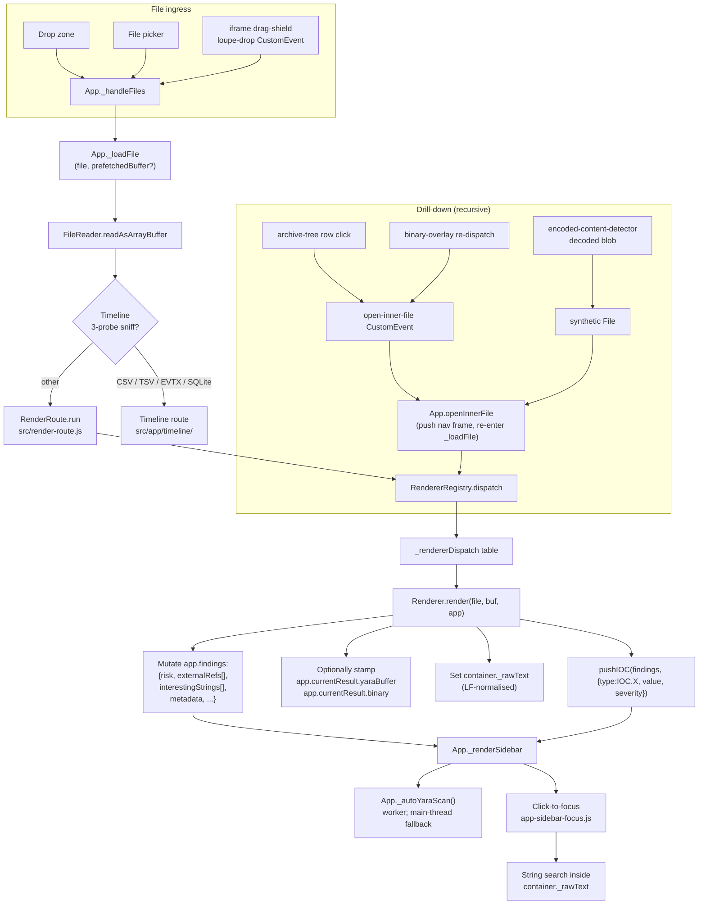
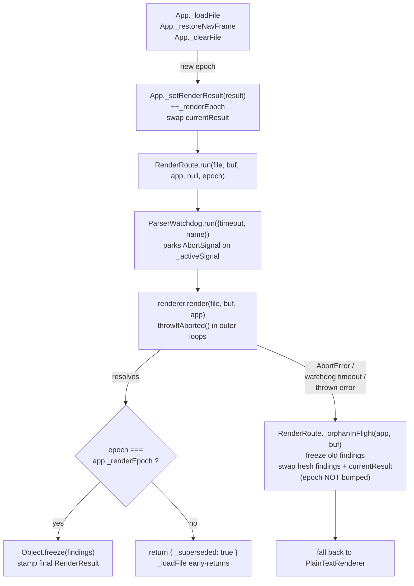

# Contributing to Loupe

> Developer guide.
> - End-user docs: [README.md](README.md)
> - Format / capability reference: [FEATURES.md](FEATURES.md)
> - Threat model & vulnerability reporting: [SECURITY.md](SECURITY.md)

---

## Footguns Cheat-Sheet

Every rule below is enforced by either a build gate (`scripts/build.py`,
`scripts/check_renderer_contract.py`, `scripts/check_regex_safety.py`) or
turns into a sidebar / runtime regression in the wild. **Read this list
before opening a PR.**

1. `docs/index.html` is a build artefact — never commit it.
2. **No `eval`, no `new Function`, no network.** CSP rejects fetches, remote scripts, and dynamic code constructors. Find another way; do not relax the CSP.
3. **IOC types must be `IOC.*` constants** (`src/constants.js`). Bare `type: 'url'` silently breaks sidebar filtering — caught by the build gate when paired with `severity:` outside `src/constants.js`.
4. **Push IOCs through `pushIOC()`** — never hand-rolled `findings.interestingStrings.push({...})`. The helper pins the wire shape and auto-emits sibling `IOC.DOMAIN` rows for URL pushes via vendored `tldts`. Pass `_noDomainSibling: true` if you've already emitted a manual domain row.
5. **Never pre-stamp `findings.risk = 'high'`.** Initialise `'low'`, escalate via `escalateRisk(findings, tier)`. Direct writes are rejected by a build gate.
6. **`container._rawText` must be wrapped in `lfNormalize(...)`** from `src/constants.js`. Click-to-focus offsets misalign past the first CR otherwise. Build gate enforces.
7. **User-input regex compiles must route through `safeRegex(...)`.** Every other `new RegExp(...)` site needs a `/* safeRegex: builtin */` annotation within 3 lines above. Enforced by `scripts/check_regex_safety.py`.
8. **No comments in `.yar` files; meta keys are a strict whitelist (`description`, `severity`, `category`, `mitre`, `applies_to`) in canonical order.** `scripts/build.py` injects `// @category: <name>` separators — those are the only `//` lines the in-browser engine tolerates. Enforced by `scripts/lint_yara.py` (`python make.py yara-lint`); use `python scripts/lint_yara.py --fix` to autofix safe issues.
9. **All persistence keys use the `loupe_` prefix** and live in the [Persistence Keys](#persistence-keys) table.
10. **Untrusted markup → `SandboxPreview.create()`** from `src/sandbox-preview.js`. Don't hand-roll `<iframe sandbox>` boilerplate.
11. **Workers spawn through `WorkerManager`** (`src/worker-manager.js`) only. A build gate rejects any `new Worker(` outside the allow-listed spawner / worker modules.
12. **File downloads through `FileDownload.*`** (`src/file-download.js`) only. Never call `URL.createObjectURL` directly.
13. **Per-dispatch size caps live in `PARSER_LIMITS.MAX_FILE_BYTES_BY_DISPATCH`.** When adding a new dispatch id, add a matching entry — falling back to `_DEFAULT` (128 MiB) silently is almost never what you want for archives, disk images, or executables.
14. **No silent `catch (...) {}`** in the load chain (`src/app/app-load.js`, `src/app/app-yara.js`). Use `App._reportNonFatal(where, err, opts?)` from `src/app/app-core.js`. Build gate enforces.
15. **Render-epoch supersession via `App._setRenderResult`** is the only path that mutates `_renderEpoch` and `currentResult`. See [Render-epoch contract](#render-epoch-contract) — the single most subtle invariant in the load chain.
16. **Hot-path renderers must finish under `PARSER_LIMITS.RENDERER_TIMEOUT_MS` (30 s).** Wrap user-gated heavy work behind a click instead of running it in `static render()`.
17. **Worker buffers cross as transferable `ArrayBuffer`.** The worker takes ownership; the main thread loses access. Re-read from the original `File` if needed.
18. **Build determinism:** no `datetime.now()` (one gated `SOURCE_DATE_EPOCH` exception), no FS iteration order, no random IDs / UUIDs / nonces, no machine-local paths, no dict/set ordering that relies on hash randomisation.
19. **`_DETECTOR_FILES` order in `scripts/build.py` is load-bearing:** class root first, helpers afterwards. Helpers attach via `Object.assign(EncodedContentDetector.prototype, {...})` and must not depend on each other's load order.

---

## Building from Source

Requires **Python 3.8+**, stdlib only — no `pip install`.

```bash
python make.py                   # default: verify → regex → parity → yara-lint → build → contract
python make.py <step> [<step>…]  # any subset, any order
```

`make.py` is a thin orchestrator over `scripts/`. Steps:
`verify` (vendor SHA-256 pins), `regex` (ReDoS scan), `parity` (JS/Py
parity gates), `yara-lint` (meta-key + comment lint), `build`
(`docs/index.html`), `contract` (renderer-contract check). Opt-in:
`sbom`, `perf`, `test`. `docs/index.html` is the single build output —
gitignored, produced locally for smoke-testing or by CI for Pages /
release signing.

### Determinism & `SOURCE_DATE_EPOCH`

`build.py` is reproducible: same commit → byte-identical output. Only
`LOUPE_VERSION` is time-derived: `SOURCE_DATE_EPOCH` env →
`git log -1 --format=%ct HEAD` → `datetime.now()` last-resort. See
[SECURITY.md § Reproducible Build](SECURITY.md#reproducible-build).

### Continuous Integration

`.github/workflows/ci.yml` runs on every push and PR **except** when
the diff is `**/*.md` or `LICENSE` only — those changes can't affect
the bundle, the lint result, or the vendored hashes, so the full
pipeline is skipped. Anything else (`src/`, `vendor/`, `scripts/`,
`tests/`, `.github/`, eslint config, `make.py`, …) still triggers the
full run. `release.yml` is downstream of CI via `workflow_run` and so
inherits the same gate — doc-only commits also skip Pages and Release.
Use `workflow_dispatch` on the Actions tab to force a rebuild.

| Job | Guarantees |
|---|---|
| `build` | `scripts/build.py` succeeds; SHA-256 + size in summary; bundle uploaded as artefact. |
| `verify-vendored` | Every `vendor/*.js` matches its `VENDORED.md` SHA-256 pin (no missing, no unpinned). |
| `yara-lint` | Comments, meta-key whitelist, canonical key order, severity values. |
| `static-checks` | On the built `docs/index.html`: CSP meta present, `default-src 'none'` intact, no inline handlers, no `unsafe-eval`, no remote CSP hosts. |
| `lint` | ESLint 9 over `src/**/*.js` (real foot-guns — `no-eval`, `no-new-func`, `no-const-assign`, …, not style). |
| `unit` | Node `node:test` over `tests/unit/` in a `vm.Context`. |
| `e2e` | Playwright over fixtures + UI; builds `docs/index.test.html` inline. |
| `deploy-pages` | On `main` only: publishes `docs/index.html` to GitHub Pages. |

`codeql.yml` (push-to-main + weekly) runs the `security-extended`
query pack; `scorecard.yml` publishes weekly OpenSSF Scorecard results
to the Security tab + the README badge endpoint.

`release.yml` is chained off CI via `workflow_run`, fires only after a
green `push`-triggered run on `main`, and checks out the exact
`head_sha` CI validated — i.e. **a commit gets a GitHub Release ⇔ its
CI run went green on `main` and was deployed to Pages**.

GitHub Actions are pinned by full 40-char commit SHA with the version
in a trailing comment; Dependabot rotates them weekly. Loupe has zero
runtime package dependencies; vendored libraries are hand-pinned by
SHA-256 in `VENDORED.md`.

---

## Testing

Three independent layers, all opt-in:

```bash
python make.py test          # test-build → test-unit → test-e2e
python make.py test-build    # rebuild docs/index.test.html (--test-api)
python make.py test-unit     # Node node:test over tests/unit/
python make.py test-e2e      # Playwright (e2e-fixtures + e2e-ui)
```

| Layer | Runner | Covers |
|---|---|---|
| `tests/unit/` | Node `node:test` (Node ≥ 20) | Pure modules in a `vm.Context`. No DOM, no App. |
| `tests/e2e-fixtures/` | Playwright + `docs/index.test.html` | Real fixtures driven through `__loupeTest.loadBytes` → real `App._loadFile` → asserted findings shape. |
| `tests/e2e-ui/` | Playwright | Ingress paths — file picker (`setInputFiles`), drag-drop (synthetic `DragEvent`), paste (planned). |

`scripts/build.py --test-api` produces `docs/index.test.html`
(gitignored) including `src/app/app-test-api.js`. The release path
never passes the flag; `_check_no_test_api_in_release()` re-reads the
emitted bundle and fails on `__LOUPE_TEST_API__` / `__loupeTest`. The
reproducibility guarantee in [SECURITY.md § Reproducible
Build](SECURITY.md#reproducible-build) covers `docs/index.html` only.

Full runbook (Playwright provisioning, `__loupeTest` surface,
performance harness): `tests/README.md` + `tests/perf/README.md`.

---

## Architecture & Signal Chain

The path a file takes from drop to sidebar, who mutates what, and the
cross-cutting contracts that hold it together. Prescriptive renderer
rules live in [Renderer Contract](#renderer-contract).

### Signal chain (ingress → render → sidebar)



### Render-epoch contract

`app._renderEpoch` is a monotonic counter fencing each renderer
dispatch from late writes by an earlier one. Renderers mutate
`app.findings` / `app.currentResult` **in place**, so without it a
hung renderer past the watchdog paints over a fallback view's state.

`App._setRenderResult(result)` (`src/app/app-load.js`) is the only
bumper of `_renderEpoch`; `_loadFile` threads the new value into
`RenderRoute.run(file, buf, app, null, epoch)`. On fallback (watchdog
timeout / size-cap / thrown error), `RenderRoute._orphanInFlight`
freezes old findings, swaps in fresh empties, and **does not** bump
the epoch — the only sanctioned write to `currentResult` outside
`_setRenderResult`. Before stamping the final result, `run()`
compares captured `epoch !== app._renderEpoch` and returns
`{_superseded: true}` if a newer dispatch has won; `_loadFile`
early-returns on the sentinel.



**What signal-aware renderers must do** (PE / ELF / Mach-O / EVTX /
encoded-content long-running loops): call `throwIfAborted()` (defined
in `src/constants.js`) at the top of each outer parse loop. For tight
inner loops with large cardinality, amortise:

```js
if ((i & 0xFF) === 0) throwIfAborted();
```

**Never** poll per-byte. Worker-driven renderers should additionally
capture `app._renderEpoch` at job-dispatch time and discard any
`onmessage` payload whose captured epoch differs from the live one.

### IOC entry shape

On-wire shape pushed by `pushIOC()` (same regardless of bucket):

```js
{
  type: IOC.URL,             // IOC.* constant
  url: '<value>',            // historical name; sidebar reads .url for any type
  severity: 'info'|'medium'|'high'|'critical',
  note?: string,
  _highlightText?: string,   // click-to-focus target; defaults to .url
  _sourceOffset?, _sourceLength?,
  _decodedFrom?, _encodedFinding?, ...
}
```

See [IOC Push Helpers & Checklist](#ioc-push-helpers--checklist) for
the helper API and sibling-emission rules.

### Drill-down: the `open-inner-file` event protocol

Recursive dispatch flows through a single bubbling `CustomEvent`
named `open-inner-file` (`event.detail` is the synthetic `File`;
optional `_prefetchedBuffer` skips a re-read). `App.openInnerFile`
listens at the shell, pushes a nav frame, and re-enters `_loadFile`.
Container renderers call `_wireInnerFileListener(docEl, parentName)`
on their returned `docEl`. The encoded-content sidebar's
`_drillDownToSynthetic` calls `openInnerFile` directly.

### YARA cost model

| Path | Trigger | Thread | Gating |
|---|---|---|---|
| Auto-YARA | Every `_loadFile` | Worker; main fallback | Worker unbounded; fallback skipped above `SYNC_YARA_FALLBACK_MAX_BYTES` (32 MiB). |
| Decoded-payload gate | After `runEncoded` finds payloads | Worker (skip if unavailable) | Default mode only; `applies_to ⊇ decoded-payload`; payload `[16 B, 256 KiB]`, ≤256/file. |
| Manual scan tab | User opens YARA tab | Worker; main fallback | Unrestricted. |
| Rules editor preview | User edits dialog | Main, sync | Unrestricted. |

**Per-string regex budgets** (`_findString`): `MAX = 1 000` retained
matches, `MAX_REGEX_ITERS = 10 000`, `TIME_BUDGET_MS = 250` (sampled
every 256 iters). `RegExp`s memoise on the rule; failures null the
slot. `YaraEngine.scan` accepts a `{errors: []}` sink; per-string
failures append `{ruleName, stringId, reason, message}`
(`reason ∈ {invalid-regex, iter-cap, time-cap, exec-error}`). Worker
forwards as `done.scanErrors` → manual-scan banner.

### Worker subsystem

Workers spawn from inline `blob:` URLs (CSP `worker-src blob:`).
Modules live in `src/workers/<name>.worker.js`, inlined as string
constants by `scripts/build.py`. `src/worker-manager.js` is the only
sanctioned spawner outside `src/workers/`. Every spawn site
try/catches `new Worker(blob:)` (Firefox at `file://` denies it); on
probe failure the spawner caches "workers unavailable" and falls back
to a sync main-thread path. Buffers transfer as `ArrayBuffer` (worker
takes ownership). Each load bumps a cancellation token; stale
`onmessage` from a terminated worker drops silently. `run*` brackets
calls with `WORKER_TIMEOUT_MS` (5 min; Timeline 30 min); on expiry
`terminate()` real-preempts the JS engine.

| Worker | Spawner | Purpose |
|---|---|---|
| `yara.worker.js` | `runYara` / `runDecodedYara` | Auto + manual + decoded-payload second pass. |
| `timeline.worker.js` | `runTimeline` | Off-thread parser for CSV / TSV / EVTX / SQLite. |
| `encoded.worker.js` | `runEncoded` | Off-thread `EncodedContentDetector.scan()`. |
| `vendor/pdf.worker.js` | `pdfjsLib` | PDF page rendering. |

YARA worker is the canonical reference for new workers.

### Encoded-content recursion

`EncodedContentDetector` (root in `src/encoded-content-detector.js`,
helpers under `src/decoders/`) drives nested base64 / hex / zlib /
chararray / SafeLinks / PowerShell-mini decoding. `_processCandidate`
is the only re-entry point with `depth + 1`; pre-transforming finders
stash `_collapsed` at find time so the inner pass collapses one ply per
round. Runs in `encoded.worker.js`; **IOC merging back into
`findings.interestingStrings` always stays on the main thread** (host
owns dedup, click-to-focus stamping, `_rawBytes` re-attachment).

To add an encoding family: drop a helper under `src/decoders/`,
extend the prototype via the trailing `Object.assign(...)` block,
append to `_DETECTOR_FILES` in `scripts/build.py`. Helpers must not
depend on each other's load order beyond "root first, helpers after".

### JS string-array obfuscation resolver

`src/decoders/js-assembly.js` defangs the canonical
obfuscator.io / `javascript-obfuscator` shape (array literal + indexer
+ sinks into `eval`/`Function`/`setTimeout`/`atob`) and emits the
recovered payload as a `cmd-obfuscation` candidate. Loads **after**
`cmd-obfuscation.js` in `_DETECTOR_FILES`. Out of scope: multiple
arrays, runtime shuffles, `Function.prototype.constructor`,
bracket-property access on indexer returns.

### Decoded-payload YARA gate

After `runEncoded` returns, `src/decoded-yara-filter.js` runs a second
YARA pass over retained payloads. Purely additive — stamps `_yaraHits`,
never prunes. Rules opt in via `meta: applies_to` ⊇ `decoded-payload`
(synthetic format tag in `YaraEngine.FORMAT_PREDICATES`); use
`applies_to = "any, decoded-payload"` for universal-rules-that-also-fire.
Bypassed in bruteforce mode; failure demotes to no-op via
`_reportNonFatal('decoded-yara-gate', …, {silent: true})`.

### Iframe sandbox helper

`src/sandbox-preview.js` is the single source of truth for the
sandboxed-iframe + overlay-drag-shield recipe used by `html-renderer`
and `svg-renderer`. `window.SandboxPreview.create({html, …})` returns
`{iframe, dragShield}` unmounted — append iframe first, drag shield
second, into the same `position: relative` container.

Pinned defaults (don't drift between renderers):

- `DEFAULT_INNER_CSP = "default-src 'none'; style-src 'unsafe-inline'; img-src data:"`
- `iframe.sandbox = 'allow-same-origin'` (parent can call
  `iframe.contentWindow.scrollBy(…)`; inner content stays scriptless
  via the inner CSP).
- Drag-drop re-dispatches as `loupe-dragenter` / `loupe-dragleave` /
  `loupe-drop` CustomEvents on `window`.

`build.py` loads `sandbox-preview.js` before HTML/SVG renderers so
`window.SandboxPreview` exists at render time.

---

## Renderer Contract

Renderers are self-contained classes exposing
`static render(file, arrayBuffer, app)` that returns a DOM element or
a `RenderResult` object. The five rules below subsume every other
"your renderer must…" instruction; enforced by
`scripts/check_renderer_contract.py` (every non-helper file must
declare `class …Renderer` and a `render(` method;
`archive-tree.js` / `grid-viewer.js` / `ole-cfb-parser.js` /
`protobuf-reader.js` are allow-listed helpers).

**Per-dispatch size cap.** `RenderRoute.run` consults
`PARSER_LIMITS.MAX_FILE_BYTES_BY_DISPATCH[dispatchId]` (`_DEFAULT`
fallback) **before** invoking the handler. Over-cap files reroute to
`plaintext` (uncapped) with a single `IOC.INFO` row. Renderers
therefore do **not** size-gate inside `static render()`.

### The five rules

1. **Return shape:** a bare `HTMLElement`, or
   `{docEl, findings?, rawText?, binary?, navTitle?, analyzer?}`.
   `RenderRoute.run` normalises both, wraps the dispatch in
   `ParserWatchdog.run({timeout: RENDERER_TIMEOUT_MS, name:
   dispatchId})`, runs `rawText` through `lfNormalize()` once, and
   stamps `app.currentResult = {docEl, findings, rawText, buffer,
   binary, yaraBuffer, navTitle, analyzer, dispatchId}` before the
   handler runs.

2. **`app.*` write contract:**

   | Field | When | Read by |
   |---|---|---|
   | `app.findings` | always | sidebar, copy-analysis, exporters |
   | `app.currentResult.yaraBuffer` | augmented surfaces (SVG / HTML inject decoded payload) | auto-YARA |
   | `app.currentResult.binary = {format, parsed}` | PE / ELF / Mach-O | verdict band, copy-analysis |
   | `container._rawText` | every text-backed renderer | click-to-focus |

   `app.currentResult.buffer` is filled by `RenderRoute.run` from the
   `ArrayBuffer` argument — renderers never write it.

3. **`container._rawText` must be `lfNormalize(...)`-wrapped** — build
   gate enforces; offsets misalign past the first CR otherwise.
4. **Never pre-stamp `findings.risk`** — see
   [Risk Tier Calibration](#risk-tier-calibration).
5. **IOC `type` is always an `IOC.*` constant via `pushIOC()`** —
   sibling rows (registrable domain, embedded IPs, punycode homoglyphs)
   come along for free. Build gate rejects bare `type: '<string>'`
   paired with `severity:` outside `src/constants.js`.

### Click-to-highlight hooks

Optional hooks a text-backed renderer can attach to its container:

| Hook | Purpose |
|---|---|
| `container._rawText: string` | LF-normalised source. Drives `_findIOCMatches` / `_highlightMatchesInline` and encoded-content line numbers. CSV/TSV writes the verbatim LF-normalised buffer (`\n` inside RFC-4180 multi-line cells included), so grid `rowOffsets` may span multiple physical newlines per logical row — expected, byte ranges align. |
| `container._showSourcePane()` | Invoked before highlighting on renderers with a Preview/Source toggle (HTML, SVG, URL). |
| `findings.augmentedBuffer: ArrayBuffer` | Optional. `app-load.js` hoists onto `app.currentResult.yaraBuffer` so auto-YARA scans the augmented surface while Copy / Save still serve the raw bytes. |

A renderer that emits a `.plaintext-table` (one `<tr>` per line, a
`.plaintext-code` cell) gets character-level match highlighting,
line-background cycling, and 5-second auto-clear for free. Others
fall back to a best-effort TreeWalker highlight on the first match.

### Risk Tier Calibration

`findings.risk ∈ {'low', 'medium', 'high', 'critical'}` — never
`'info'`, never a bespoke string. Tier is **evidence-based**, not
format-based: initialise `'low'`, then at the end of
`analyzeForSecurity()` derive from `externalRefs` severity counts:

```js
const highs   = f.externalRefs.filter(r => r.severity === 'high').length;
const hasCrit = f.externalRefs.some(r => r.severity === 'critical');
const hasMed  = f.externalRefs.some(r => r.severity === 'medium');
if      (hasCrit)    f.risk = 'critical';
else if (highs >= 2) f.risk = 'high';
else if (highs >= 1) f.risk = 'medium';
else if (hasMed)     f.risk = 'low';
```

Always write through `escalateRisk(f, tier)` — rank-monotonic, never
lowers, safe to repeat. Direct writes are rejected by the build gate.
Mirror every Detection into `externalRefs` as `IOC.PATTERN` first or
YARA-only findings are invisible to this calculation.

### IOC Push Helpers & Checklist

Two helpers in `src/constants.js`:

- **`pushIOC(findings, {type, value, severity?, highlightText?, note?, bucket?})`**
  — canonical IOC row into `interestingStrings` (or `externalRefs`
  via `bucket: 'externalRefs'`). Pins wire shape; auto-emits sibling
  `IOC.DOMAIN` for URL pushes via `tldts`, plus `IOC.IP` for embedded
  literals and `IOC.PATTERN` for punycode/IDN homoglyphs. Pass
  `_noDomainSibling: true` if you've already emitted a manual domain.
- **`mirrorMetadataIOCs(findings, {metadataKey: IOC.TYPE, ...}, opts?)`**
  — the sidebar table is fed only from `externalRefs +
  interestingStrings`; values living only on `findings.metadata` never
  reach the pivot list. Mirror **pivot** fields (hashes, paths, GUIDs,
  MAC, emails, cert fingerprints); **not** attribution fluff
  (`CompanyName`, `FileDescription`, `ProductName`, `SubjectName`).

Push checklist:

1. `type` is always an `IOC.*` constant.
2. Severity defaults to `IOC_CANONICAL_SEVERITY[type]`; escalate up
   only.
3. Carry `_highlightText`; never raw offsets into synthetic buffers.
4. Cap large IOC lists with an `IOC.INFO` truncation marker whose
   `url:` field explains the reason and the cap.
5. Mirror every `Detection` into `externalRefs` as `IOC.PATTERN` —
   without this a detection shows in the banner but is invisible to
   Summary / Share / STIX / MISP:
   ```js
   findings.externalRefs = findings.detections.map(d => ({
     type: IOC.PATTERN,
     url: `${d.name} — ${d.description}`,
     severity: d.severity
   }));
   ```
6. Every IOC must be click-to-focus navigable —
   `container._rawText`, `_showSourcePane()`, or a custom handler.
7. Generic text extraction is capped per-type
   (`_extractInterestingStrings`, `PER_TYPE_CAP = 200`); drops surface
   via `findings._iocTruncation`. Renderer-seeded IOCs are exempt —
   renderers own their own caps via item 4.

### Native-binary capability rolls and the `binaryClass` gate

PE / ELF / Mach-O drive most false positives because Win32/POSIX APIs
recur in benign tooling (media SDKs, system utilities, compilers). The
noise-reduction contract:

1. **Route capability rolls through `Capabilities.detect()`.** Don't
   push bare `IOC.PATTERN` rows for "imports `WriteProcessMemory`" —
   wire the API into a rule in `src/capabilities.js` so the cluster
   fires only when the named *behaviour* is present (`quorum`,
   `splitQuorum`, or full-AND — never `any: true` for low-severity).
2. **Compute `findings.binaryClass` once** via `BinaryClass.classify(…)`
   after the trust tier is known; mirror to
   `findings.metadata['Binary Class']`.
3. **Weight every cluster bump:**
   ```js
   const _weight  = (sev, cat) => BinaryClass.weightFor(binaryClass, sev, cat);
   const _surface = (cat)      => BinaryClass.shouldSurfaceLowSeverity(binaryClass, cat);
   ```
   `_surface(cat)` returns `false` for ubiquitous-API noise on
   signed-trusted system / media / compiler binaries.
4. **Critical clusters keep full weight regardless of trust** —
   `weightFor` returns `1` for `critical`/`high` and `≥ 0.75` for the
   BAD set (`injection`, `cred-theft`, `ransomware`, `hooking`,
   `persistence`). A stolen-but-trusted cert must never suppress an
   injection capability.
5. **Suppressed capabilities go to `metadata['Suppressed
   Capability']`** — never drop silently.
6. **YARA detections are NEVER demoted** — the gate only consults
   renderer-emitted clusters and `Capabilities.detect` results.

### Nicelist tagging — read tags, don't recompute

`annotateNicelist(findings)` (`src/nicelist-annotate.js`) is the sole
stamper of `_nicelisted` / `_nicelistSource` on
`externalRefs` / `interestingStrings`, called once at the end of
`_loadFile` so every consumer (sidebar, Summary, STIX, MISP, CSV) sees
the same view. Renderers must **not** read or set these flags; to
suppress a benign hostname, add an entry to `src/nicelist.js`. Export
consumers re-call `annotateNicelist` defensively (guarded on
`typeof r._nicelisted === 'undefined'`) so synthetic findings still
get tagged.

### RowStore container contract

Every tabular renderer (csv, tsv, evtx, sqlite, xlsx, json, timeline)
hands `GridViewer` a `RowStore` (`src/row-store.js`); the `string[][]`
payload is retired — `GridViewer` throws if `opts.store` is missing or
fails the `getCell` shape check.

| Factory | Use when |
|---|---|
| `RowStore.fromStringMatrix(columns, rows)` | Full matrix in memory (sqlite, evtx, xlsx, json, small CSV). |
| `RowStore.fromChunks(columns, chunks)` | Worker hand-off pre-packed via `packRowChunk`. |
| `RowStore.empty(columns)` | Placeholder so the grid mounts immediately; `setRows` swaps in the real store. |

Incremental construction: `RowStoreBuilder` — `addRow` / `addChunk`
then `finalize()` (single-shot).

- **Hot-path:** `getCell(r, c)` is allocation-free — use it in inner
  loops. `getRow(r)` allocates — exports + `TimelineRowView` only.
- **Heap budget:** CSV/TSV ingress consults
  `RENDER_LIMITS.ROWSTORE_HEAP_BUDGET_FRACTION` (0.6 × Chromium
  `performance.memory`) before kicking off the worker parse; silent
  no-op on Firefox/Safari.
- **Live column mutation:** `viewer._updateColumns(newColumns)` swaps
  `this.columns` in place — supports tail-append / tail-truncate
  only (must share prefix with the existing array). Canonical caller:
  Timeline's `_rebuildExtractedStateAndRender`. Use this instead of
  destroy/rebuild (which the user sees as a one-frame flash).

### Renderer registry

The authoritative list of every wired renderer is
`src/renderer-registry.js` (probe → renderer-class map). Don't duplicate
it here — it goes stale immediately. Listing-only archive drill-down
(`7z` / `rar` / `dmg`) is by design: Loupe ships no LZMA / LZSS / PPMd /
APFS decoder.

### Synthetic file roots (`FolderFile`)

`src/folder-file.js` is the only sanctioned exception to "every load is
a real on-disk byte stream". A `FolderFile` quacks like a `File`
(`{ name, size, type, lastModified, arrayBuffer(), text() }`) but its
buffer is zero bytes — the payload is the `_loupeFolderEntries` flat
list of leaf metadata + back-refs to real `File` objects.

When to add another synthetic root:

  * The user-visible thing being analysed is **structurally a
    container** (folder, multi-file drop, hypothetical
    multi-paste-into-one-view), and
  * Per-leaf analysis already works through the `open-inner-file`
    drill-down protocol (`_wireInnerFileListener`).

Rules every synthetic root must follow:

  1. Carry a marker field the registry's magic predicate keys on
     (e.g. `_loupeFolderEntries`). Predicate sits at the **top** of
     `RendererRegistry.ENTRIES` so it short-circuits before any byte-
     based detection.
  2. Add a `MAX_FILE_BYTES_BY_DISPATCH[id] = Number.POSITIVE_INFINITY`
     row in `src/constants.js`. The byte cap is meaningless when the
     bytes are virtual; the cap that matters is the per-shape entry
     count (e.g. `PARSER_LIMITS.MAX_FOLDER_ENTRIES`).
  3. Set `isFolderRoot`-style flag in `app-load.js` to skip the
     IOC mass-extract, encoded-content scan, and auto-YARA. Those
     three operate on the rendered text and produce nothing but
     noise on a synthesised root.
  4. The synthetic-root renderer's `analyzeForSecurity` runs **only
     metadata** heuristics (filenames, entry counts, truncation
     status). Per-byte heuristics happen organically when the
     analyst clicks a leaf.
  5. The renderer dispatch handler MUST call
     `this._wireInnerFileListener(docEl, file.name)` so leaves
     bubble through `open-inner-file` into `App.openInnerFile`.
  6. `_restoreNavFrame` resets `_archiveBudget` when the restored
     frame is a synthetic root (`currentResult.dispatchId === '<id>'`).
     Synthetic roots model independent siblings, not nested archive
     descendants — without a reset on Back, opening five samples in
     sequence would bleed budget across them.
  7. **Paths in the entry list are root-relative.** The synthetic root
     IS the dropped container — the renderer header carries its name.
     Entries MUST NOT include the root name as a leading segment, or
     the tree paints a redundant subfolder under the header (e.g.
     `📁 forensics → forensics → file.txt`). Strip leading-root
     segments at the ingress site (see `_ingestFolderFromRelativePaths`
     in `app-core.js`) or use the `{ entry, asRoot: true }` shape
     `FolderFile.fromEntries` accepts for "this directory IS the root,
     walk its children with empty prefix".
  8. **Auto-expand on first paint.** Synthetic roots pass
     `ArchiveTree.render({ expandAll: true })` so the analyst sees the
     entire structure immediately. Real archive renderers use
     `expandAll: 'auto'` instead, which expands iff
     `entries.length <= ArchiveTree.AUTO_EXPAND_MAX_ENTRIES` (256) —
     bounds first-paint cost on huge ZIPs while keeping the small-
     archive UX consistent with folder ingest.

---

## Footguns & Tripwires

If you skip this section your change will probably still build, then
subtly misbehave.

### Build artefacts & source of truth

- **`docs/index.html` is generated and gitignored.** Rebuild with
  `python make.py build` (or the chained default) after `src/`
  changes; CI publishes the canonical bytes.
- **JS load order in `scripts/build.py` is load-bearing.** Three
  groups: `EARLY_JS_FILES` (capture-phase drag/drop/paste glue —
  first), `APP_JS_FILES` (constants → helpers → renderers → `App` +
  prototype mixins → `new App().init()` at the very end), and heavy
  renderer-only vendors emitted **after** the App `<script>` so vendor
  compile doesn't block `App._setupDrop()`.
- **`Object.assign(App.prototype, …)` ordering rules** (later
  overrides earlier): `app-bg.js` before `app-core.js` /
  `app-ui.js`; `app-copy-analysis.js` after `app-ui.js`;
  `app-sidebar-focus.js` after `app-sidebar.js`; `app-settings.js`
  after `app-ui.js` and `app-copy-analysis.js`.
- **Timeline route (`src/app/timeline/`) is analysis-bypass** — owns
  the only viewer path for CSV / TSV / EVTX / SQLite, but pushes no
  IOCs, mutates no `app.findings`, runs no `EncodedContentDetector`.
  EVTX is the sole exception via `EvtxDetector.analyzeForSecurity`.
- **`EncodedContentDetector` is split** — class root in
  `src/encoded-content-detector.js`, helper modules under
  `src/decoders/` attached via prototype mixin. Canonical load order
  in `_DETECTOR_FILES` (`scripts/build.py`) is splatted into both the
  main bundle and the encoded worker so they cannot drift.

### Regex Safety

ReDoS is in scope for any pattern compiled against user input
(Timeline DSL, Timeline regex-extract, YARA rule editor, archive-tree
search) or attacker-controlled file content. `safeRegex(...)` /
`safeExec` / `safeTest` / `safeMatchAll` (in `src/constants.js`)
reject 2 KB+ patterns and the duplicate-adjacent-quantified-group
shape, warn on nested unbounded quantifiers, and provide a wall-clock
budget. Every other `new RegExp(...)` callsite must carry
`/* safeRegex: builtin */` within 3 lines above; enforced by
`scripts/check_regex_safety.py`.

User-regex compile sites (must route through `safeRegex`):

| Site | Budget | Failure mode |
|------|--------|--------------|
| Timeline regex-extract preview | 50 ms `safeExec` × 200-row sample | "Pattern timed out" status |
| Timeline regex-extract commit | 1 K-row dry run | Toast + refuse to commit |
| Timeline DSL filter compile | `safeRegex` shape rejection | Toast on filter apply |
| Timeline drawer highlighter | `safeRegex` compile | Silent disable for that drawer |
| YARA editor rule import | 2 KB pattern length cap | Validation error |

### Renderer conventions

- **Wide renderer roots must opt in.** `#viewer` is a flex column with
  `align-items: center`, which shrink-wraps unconstrained children.
  Declare `align-self: stretch; width: 100%; min-width: 0` (+
  `table-layout: fixed` for tables).
- **Soft-wrap pathologically long lines.** A 2 MB `<td>` tanks
  layout / paint / click-to-focus. See `PlainTextRenderer.RICH_MAX_LINE_LEN`
  / `SOFT_WRAP_CHUNK`.
- **Two limit constants, two jobs:** `PARSER_LIMITS` is the *safety*
  envelope (`MAX_DEPTH`, `MAX_UNCOMPRESSED`, `MAX_RATIO`,
  `MAX_ENTRIES`, `RENDERER_TIMEOUT_MS`, `SYNC_YARA_FALLBACK_MAX_BYTES`)
  — raising weakens defences. `RENDER_LIMITS` caps **parsed data** the
  UI renders (`MAX_TEXT_LINES`, `MAX_CSV_ROWS`, `MAX_TIMELINE_ROWS`,
  `MAX_EVTX_EVENTS`) — raising affects only completeness / memory.
- **EVTX column names** live in `EVTX_COLUMNS` / `EVTX_COLUMN_ORDER`.
  Use constants, not bare `'Event ID'` strings.
- **`_reportNonFatal(where, err, opts?)`** (`src/app/app-core.js`)
  replaces silent `catch {}`. Emits a `[loupe] <where>: <message>`
  breadcrumb; unless `silent: true`, pushes an `IOC.INFO` row and
  coalesces a sidebar refresh. Build gate enforces in `app-load.js` /
  `app-yara.js`; escape-hatch comment `// loupe-allow:silent-catch`
  (unused in tree).

### Determinism (`scripts/build.py` and anything it calls)

No `datetime.now()` (one gated `SOURCE_DATE_EPOCH` fallback aside);
no file-system iteration order (use explicit `JS_FILES` / `CSS_FILES`
/ `YARA_FILES`); no random IDs / UUIDs / nonces (derive from input
SHA-256); no machine-local paths in output; no dict/set ordering that
relies on hash randomisation (sort first).

---

## Persistence Keys

Every user preference lives in `localStorage` under the `loupe_`
prefix — easy to grep, easy to clear with one filter, auditable
against this table.

All values are strings (JSON-encoded where the shape says so).
"Written by" lists the named accessor; read sites validate against
the documented values.

| Key | Written by | Values / shape |
|---|---|---|
| `loupe_theme` | `_setTheme` (`app-ui.js`) | `light` / `dark` / `midnight` / `solarized` / `mocha` / `latte`. FOUC bootstrap applies before first paint; missing/invalid falls back to OS `prefers-color-scheme` then `dark`. |
| `loupe_summary_target` | `_setSummaryTarget` (`app-settings.js`) | `default` / `large` / `unlimited`. Drives the build-full → measure → shrink-to-fit assembler. Char budgets `64 000` / `200 000` / `Infinity`. |
| `loupe_uploaded_yara` | `setUploadedYara` (`app-yara.js`) | Raw concatenated `.yar` text. Merged with the default ruleset at scan time. |
| `loupe_ioc_hide_nicelisted` | `_setHideNicelisted` (`app-sidebar.js`) | `"0"` (show, dimmed — default) or `"1"` (hide). |
| `loupe_summary_include_nicelisted` | Summary builder (`app-ui.js`) | `"group"` (separate sub-table — default), `"omit"` (drop nicelisted rows), or `"inline"` (single combined table, no marker). |
| `loupe_nicelist_builtin_enabled` | `setBuiltinEnabled` (`nicelist-user.js`) | `"1"` (on — default) / `"0"` (off). |
| `loupe_nicelists_user` | `save` (`nicelist-user.js`) | `{version:1, lists:[{id,name,enabled,createdAt,updatedAt,entries}]}`. Capped at 64 lists × 10 000 entries × 1 MB. |
| `loupe_plaintext_highlight` | `PlainTextRenderer._writeHighlightPref` | `"on"` (default) / `"off"`. Hidden — and highlighting skipped — by the shared rich-render gate (see `loupe_plaintext_wrap`), plus a hljs-loaded check. |
| `loupe_plaintext_wrap` | `PlainTextRenderer._writeWrapPref` | `"on"` (default) / `"off"`. Hidden — and wrap forced off — by the shared rich-render gate (`RICH_MAX_BYTES` 512 KB / `RICH_MAX_LINES` 10 000 / `RICH_MAX_LINE_LEN` 5 000 chars), which gates highlight too. |
| `loupe_grid_drawer_w` | `_saveDrawerWidth` (`grid-viewer.js`) | Row-details drawer width in px. Default 420; min 280; max dynamic. |
| `loupe_grid_colW_<gridKey>` | `_saveUserColumnWidth` | `{"<colIdx>": pxWidth, …}`. Per-renderer manual overrides; double-clicking a handle deletes the entry to restore auto-size. |
| `loupe_timeline_grid_h` | `.tl-splitter` drag | Virtual-grid pane height in px (clamped on read). |
| `loupe_timeline_chart_h` | `.tl-chart-resize` drag | Histogram pane height in px. Default 220; clamp 120 – 600. |
| `loupe_timeline_bucket` | toolbar bucket picker | `1m` / `5m` / `1h` / `1d` / …. |
| `loupe_timeline_sections` | section chevrons | `{chart, grid, columns, pivot, …}` — `true` = collapsed. |
| `loupe_timeline_card_widths` | edge resize on `.tl-col-card` / `.tl-entity-group` | `{"<fileKey>": {"<key>": {span: N}, …}}`. fileKey = `name\|size\|lastModified`. |
| `loupe_timeline_card_order` | drag card headers | `{"<fileKey>": ["colName", …]}`. |
| `loupe_timeline_grid_col_order` | drag a Timeline grid header | `{"<fileKey>": ["colName", …]}`. Stored by NAME so extracted columns survive reload at different real index. Applied via `_applyGridColOrder` on mount + after `_updateColumns`. |
| `loupe_timeline_pinned_cols` | 📌 pin | `{"<fileKey>": [...]}` — pinned cards sort top-left. |
| `loupe_timeline_entity_pinned` | 📌 on Entities | `{"<fileKey>": ["entity:<IOC_TYPE>", …]}`. |
| `loupe_timeline_entity_order` | drag-reorder Entities | `{"<fileKey>": ["entity:<IOC_TYPE>", …]}`. |
| `loupe_timeline_detections_group` | "Group by ATT&CK tactic" | `"1"` / `"0"`. |
| `loupe_timeline_regex_extracts` | ƒx Extract dialog | `{"<fileKey>": [{name, col, pattern, flags, group, kind}, …]}`. JSON-path extractions are NOT persisted. |
| `loupe_timeline_pivot` | Pivot selectors | `{rows, cols, aggOp: "count"\|"distinct"\|"sum", aggCol}`. |
| `loupe_timeline_query` | DSL editor | Last-used query string. |
| `loupe_timeline_query_history` | ⌄ history button | Recent non-empty queries, capped ~20. |
| `loupe_timeline_sus_marks` | right-click → 🚩 | Persisted by column NAME (not index). Tints rows red; does NOT filter. |
| `loupe_timeline_autoextract_toast_shown` | post-apply auto-extract toast | `{"<fileKey>": true}` — gates ONLY the toast; the extraction re-runs deterministically on every open. Auto-extracted columns are EPHEMERAL (only Regex-tab extracts persist via `loupe_timeline_regex_extracts`). |
| `loupe_timeline_geoip_done` | GeoIP/ASN enrichment | `{"<fileKey>": true}` — keeps deleted geo/asn columns deleted on reopen and skips IP-detect for IP-less files. |
| `loupe_hosted_dismissed` | `_checkHostedMode` | `"1"` when the hosted-mode privacy bar is dismissed. |
| `loupe_dev_breadcrumbs` | `_toggleDevBreadcrumbs` | `"1"` mounts dev-breadcrumb ribbon. Toggle from devtools — no Settings UI. |
| `loupe_deobf_selection_enabled` | `_setSelectionDecodeEnabled` | `"1"` (default) / `"0"`. Floating "🔍 Decode selection" chip. |

**Timeline ↺ Reset** wipes every `loupe_timeline_*` key plus
`loupe_grid_drawer_w` and every `loupe_grid_colW_tl-grid-inner_*`
override. New `loupe_timeline_*` keys are covered by the prefix sweep
automatically.

**Adding a key:** use the `loupe_<feature>` prefix; read/write through
a named accessor in the owning `app-*.js`; validate on read with a
hard-coded default fallback; add a row to this table in the same PR.

### IndexedDB Stores

Use IndexedDB **only** for binary blobs too large for `localStorage`'s
~5 MB quota. Each store is fronted by an accessor module under
`src/<feature>/` so `open()` boilerplate lives in one place.

| Database | Keys | Accessor | What it holds |
|---|---|---|---|
| `loupe-geoip` (v2) | `mmdb-geo` / `mmdb-asn` + `*-meta` | `src/geoip/geoip-store.js` | Two user-uploaded MMDB slots: `geo` (Country/City/Region) and `asn` (AS/Organisation). v1→v2 migration moves the legacy `mmdb` key into the geo slot. |

**Adding a store:** `src/<feature>/<feature>-store.js` exposing
Promise-returning `load()` / `save()` / `clear()`; one DB + one object
store per feature; bump `version` + provide `onupgradeneeded` for
schema changes; degrade gracefully when IndexedDB is unavailable
(`load` returns `null`); add a row above and a `SECURITY.md` §
"Persisted user data" paragraph.

---

## Adding things

Quick recipes. Always run `python make.py` after; stage only `src/`
edits.

### File-format renderer

1. `src/renderers/foo-renderer.js` exposing
   `static render(file, arrayBuffer, app)`.
2. Register in `src/renderer-registry.js` (+ route in
   `src/app/app-load.js` if extension-driven).
3. Add to `JS_FILES` in `scripts/build.py` (after `renderer-registry.js`,
   before `app-core.js`).
4. Viewer styles → `src/styles/viewers.css`.
5. **Docs:** formats row in `FEATURES.md`; headline capability also in
   `README.md`.

### YARA rule

1. Append to the appropriate `src/rules/*.yar` (no `//` comments — the
   linter rejects them; explanations belong in `meta:`).
2. `meta:` keys are a strict whitelist in this order:
   `description` (required) · `severity`
   (`info|low|medium|high|critical`) · `category` · `mitre` ·
   `applies_to`. Other keys are rejected. `python scripts/lint_yara.py
   --fix` normalises order, strips comments, trims whitespace.
3. **Docs:** add a row to `FEATURES.md`'s security-analysis table only
   if the rule flags a **new class** of threat.

### Export format

Toolbar **📤 Export** is a declarative menu in `src/app/app-ui.js`.
Exporters are offline, sync (or `async` for `crypto.subtle` only), and
default to the clipboard.

1. Add `_buildXxx(model)` + `_exportXxx()` to the
   `Object.assign(App.prototype, {...})` block. Reuse `_collectIocs`,
   `_fileMeta`, `fileHashes`, `findings`, `_fileSourceRecord`,
   `_copyToClipboard` + `_toast`, `_buildAnalysisText(Infinity)`. For
   actual file output use `_downloadText/Bytes/Json` /
   `_exportFilename` — **never call `URL.createObjectURL` directly**;
   add a helper to `src/file-download.js`.
2. Register in `_getExportMenuItems()` —
   `{ id, icon, label, action }`. Prefix label with `Copy ` for
   clipboard actions; `{ separator: true }` for dividers.
3. The dispatcher in `_openExportMenu()` wraps every action in
   try/catch + error toast.
4. **Don't** vendor a new library (use `crypto.subtle` /
   existing `_uuidv5()`), fabricate vendor-specific extensions (e.g.
   `x_loupe_*` STIX properties), or relax CSP.
5. **Docs:** column in `FEATURES.md § Exports`.

### Theme

A theme is a token overlay — never selectors / layout / components.

1. `src/styles/themes/<id>.css` scoped to `body.theme-<id>`,
   re-declaring only tokens from `src/styles/core.css` (accent, risk
   palette, hairlines, panels, text, banners). Never use a hardcoded
   hex / `rgba(...)` in `body.dark` — there's a token for every
   surface.
2. Register in `CSS_FILES` (`scripts/build.py`).
3. Register in `THEMES` (`src/app/app-ui.js`) —
   `{ id, label, icon, dark }`.
4. Add the id to `THEME_IDS` in the FOUC bootstrap inside
   `scripts/build.py`; also `DARK_THEMES` if dark.
5. *(Optional)* map an engine in `THEME_ENGINES` (`src/app/app-bg.js`):
   `penroseLight`, `networkDark`, `penrose`, `cuteKitties`,
   `cuteHearts`, or `null`.
6. **Docs:** `FEATURES.md` if shipped in the picker; `README.md` only
   if promoted.

The FOUC bootstrap stamps the saved theme class on `<body>` before
first paint (or stashes on `<html>` + one-shot `MutationObserver` if
`<body>` hasn't parsed yet). Fallback: saved `loupe_theme` → OS
`prefers-color-scheme` → `'dark'`.

### Vendored library (new or upgrade)

1. Drop upstream bytes at `vendor/<name>.js` **unmodified**.
2. SHA-256 it (`sha256sum` / `Get-FileHash -Algorithm SHA256`).
3. New library: read & inline it in `scripts/build.py`.
4. **Docs (required):** rotate the row in `VENDORED.md` — path,
   version, licence, SHA-256, upstream URL. A vendor change without a
   `VENDORED.md` change fails CI.

### Security-relevant default (CSP / parser limits / sandbox flags)

1. Edit the appropriate source (`scripts/build.py` for CSP,
   `src/parser-watchdog.js` / `src/constants.js` for `PARSER_LIMITS`).
2. **Docs (required):** update the relevant row in `SECURITY.md`
   (threat model or design decisions); flag user-visible changes in
   `FEATURES.md`.

---

## How to Contribute

Fork → edit `src/` → `python make.py` → smoke-test the rebuilt
`docs/index.html` → stage `src/` edits only → PR. YARA rules, new
parsers, and build improvements are especially
welcome. Vanilla JS by design (no frameworks, no bundlers beyond
`scripts/build.py`) to keep the bundle auditable.
