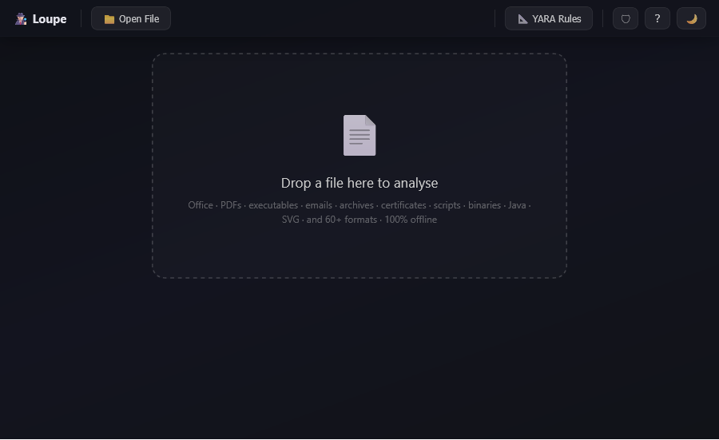
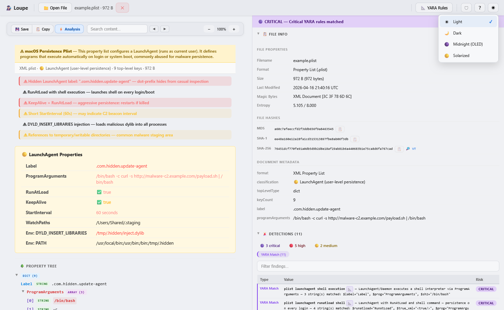
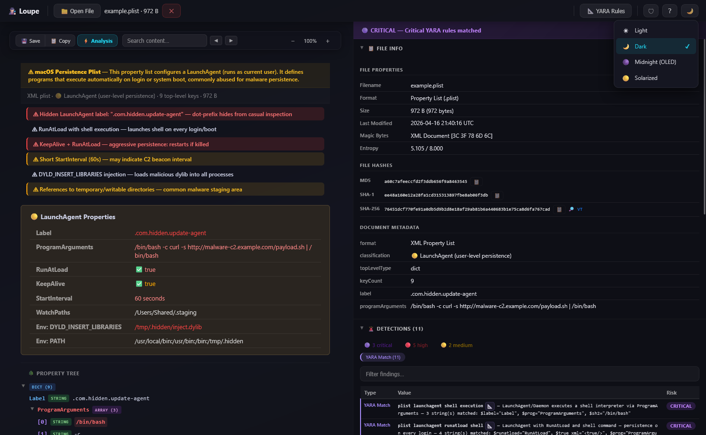
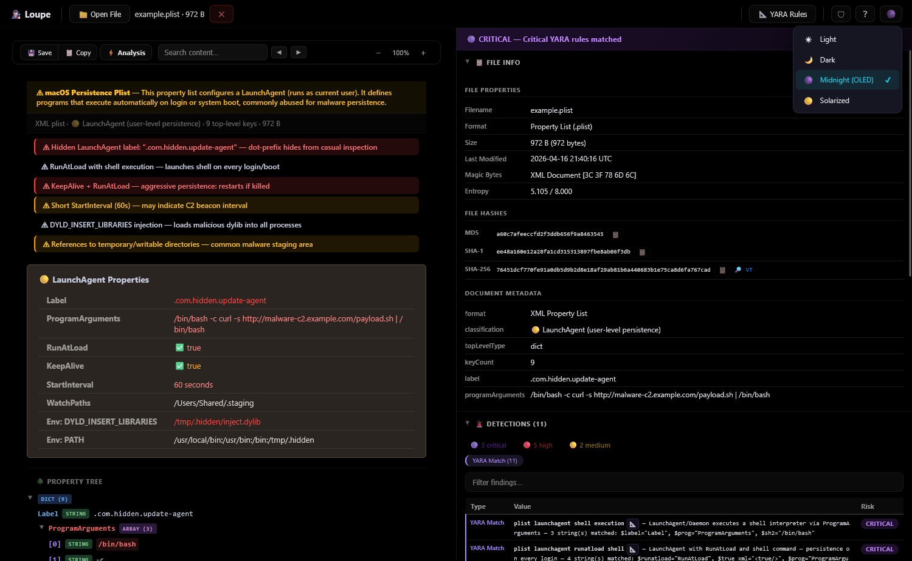
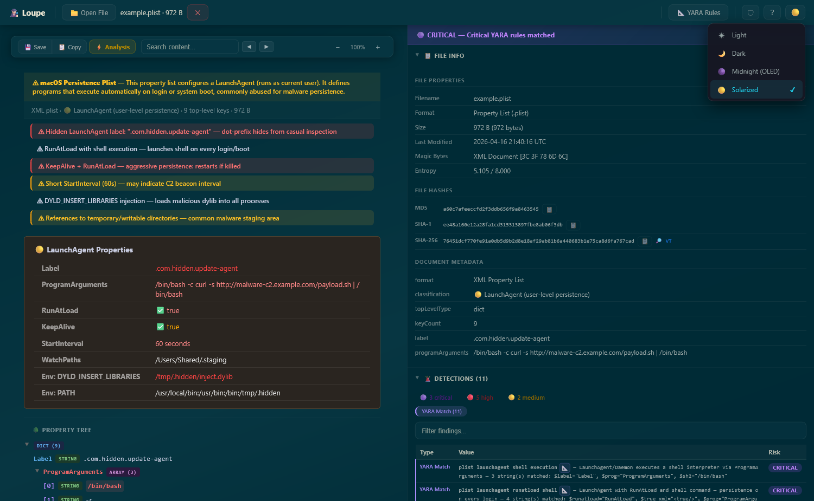

# 🕵🏻 Loupe

**A 100% offline, single-file security analyser for suspicious files.**
No server, no uploads, no tracking — just drop a file and inspect it.

  <a href="FEATURES.md">📖 Features</a> ·
  <a href="SECURITY.md">🔒 Security</a> ·
  <a href="CONTRIBUTING.md">🛠️ Contributing</a> ·
  <a href="VENDORED.md">📦 Vendored</a>

> **<a href="https://loupe.tools/" target="_blank" rel="noopener">▶ Launch the live demo</a>**

 
<em>Loupe — drop a file, inspect it safely, entirely in your browser.</em>

---

## 🤔 Why Loupe?

SOC analysts, incident responders, and security-conscious users need a way to safely inspect suspicious files without uploading them to third-party services or spinning up a sandbox. Loupe runs entirely in your browser — **nothing ever leaves your machine**.

- **Zero network access** — a strict Content-Security-Policy blocks all external fetches.
- **Single HTML file** — no install, no dependencies, works on any OS with a modern browser.
- **Broad format coverage** — Office documents, PDFs, emails, archives, native binaries (PE/ELF/Mach-O), certificates, scripts, images, and more.

---

## 🚀 Quick Start

[⬇️ **Download latest loupe.html**](https://github.com/Loupe-tools/Loupe/releases/latest/download/loupe.html)

1. **Download** — grab `loupe.html` from the release link above, or clone the repo and open `docs/index.html`.
2. **Open** — double-click the file in any modern browser (2023+: Chrome, Firefox, Edge, Safari). No server needed.
3. **Drop a file** — drag a suspicious file onto the drop zone, click **📁 Open File**, or paste with **Ctrl+V**.
4. **Inspect** — press **S** to toggle the security sidebar with risk assessment, IOCs, and YARA matches. Press **Y** to open the YARA rules dialog (upload custom `.yar` files, validate, re-scan). Press **?** for all shortcuts.

---

## 🛡 Supported Formats

| Category | Extensions |
|---|---|
| **Office** | `.docx` `.docm` `.xlsx` `.xlsm` `.pptx` `.pptm` `.ods` `.doc` `.xls` `.ppt` `.odt` `.odp` `.rtf` |
| **Documents** | `.pdf` `.one` |
| **Email** | `.eml` `.msg` |
| **Web** | `.html` `.htm` `.mht` `.mhtml` `.xhtml` `.svg` |
| **Archives** | `.zip` `.gz` `.gzip` `.tar` `.tgz` `.rar` `.7z` `.cab` `.iso` `.img` |
| **Windows** | `.lnk` `.hta` `.url` `.webloc` `.website` `.reg` `.inf` `.sct` `.msi` `.exe` `.dll` `.sys` `.scr` `.cpl` `.ocx` `.drv` `.com` `.xll` `.application` `.manifest` `.msix` `.msixbundle` `.appx` `.appxbundle` `.appinstaller` |
| **Browser extensions** | `.crx` (Chrome / Chromium / Edge) · `.xpi` (Firefox / Thunderbird) |
| **Linux / IoT** | ELF binaries (`.so`, `.o`, `.elf`, extensionless) |
| **macOS** | Mach-O binaries (`.dylib`, `.bundle`, Fat/Universal) · `.applescript` `.scpt` `.scptd` `.jxa` `.plist` · `.dmg` `.pkg` `.mpkg` |
| **Certificates** | `.pem` `.der` `.crt` `.cer` `.p12` `.pfx` `.key` *(auto-disambiguated against PGP)* |
| **OpenPGP** | `.pgp` `.gpg` `.asc` `.sig` |
| **Java** | `.jar` `.war` `.ear` `.class` |
| **Scripts** | `.wsf` `.wsc` `.wsh` `.vbs` `.ps1` `.bat` `.cmd` `.js` |
| **Forensics** | `.evtx` `.sqlite` `.db` |
| **Data** | `.csv` `.tsv` `.iqy` `.slk` |
| **Images** | `.jpg` `.png` `.gif` `.bmp` `.webp` `.ico` `.tif` `.avif` |
| **Catch-all** | *Any file* — text or hex dump view |

Every format gets risk assessment, IOC extraction, and YARA scanning on top of the format-specific parser. See **[FEATURES.md](FEATURES.md)** for the full capability reference.

---

## 🔍 What It Finds

- **YARA rule engine** — 493 default rules auto-scan every file; upload your own `.yar` files to extend detection
- **IOC extraction** — URLs, IPs, emails, file paths, UNC paths (including refanged `hxxp://` / `1[.]2[.]3[.]4`)
- **File hashes** — MD5, SHA-1, SHA-256 with one-click VirusTotal lookup
- **Macro / VBA analysis** — decoded source, auto-exec entry points, downloadable as `.txt` or raw `vbaProject.bin`
- **Encoded payload detection** — Base64, hex, Base32, gzip/zlib/deflate; decodes and recursively drills in
- **PDF JavaScript & attachment extraction** — every `/JS` body pulled with per-script hash, size, trigger and suspicious-API hints; `/EmbeddedFile` attachments open inline as a new analysis frame
- **Native binary analysis** — PE, ELF and Mach-O with imports, sections, entropy, security features, code signatures; truncated binaries fall back to strings + hex dump so YARA/IOC scanning keeps working
- **Certificate & PGP inspection** — X.509 / PKCS#12 / OpenPGP with weak-key and expiry flagging
- **Archive drill-down** — click any entry inside a ZIP / TAR / ISO / MSI to open it with full analysis
- **Exports** — one-click **⚡ Summary** for an AI/SOC clipboard brief (budget configurable from 4 K chars up to unbounded via a 10-stop log slider in ⚙ Settings; the live token chip next to the button — `4K` · `16K` · `MAX` — tells you what you'll paste), plus a **📤 Export** menu for STIX 2.1 / MISP / IOC JSON / IOC CSV (clipboard) and raw-file save

Plus a Midnight Glass UI with a 6-theme picker (Light / Dark / Midnight OLED / Solarized / Mocha / Latte — your choice persists), a unified **⚙ Settings / Help** dialog (`,` for Settings, `?` or `H` for Help, theme tiles included) with floating zoom, drag-pan, a resizable sidebar, in-toolbar document search, and click-to-highlight for every IOC and YARA match.

---

## 🎨 Themes

Six built-in themes, selectable from the **⚙ Settings** dialog — your choice persists via `localStorage`.

 

 
<em>Light · Dark (default) · Midnight (OLED pure-black) · Solarized Dark · Mocha · Latte</em>

---

## 🎬 Try It Yourself

Drop one of these into Loupe to see it in action — the [`examples/`](examples/) directory has many more.

- [`examples/encoded-payloads/nested-double-b64-ip.txt`](examples/encoded-payloads/nested-double-b64-ip.txt) — double Base64 hiding a C2 IP (recursive decode drill-down)
- [`examples/email/phishing-example.eml`](examples/email/phishing-example.eml) — SPF/DKIM/DMARC failures + tracking pixel
- [`examples/windows-scripts/example.lnk`](examples/windows-scripts/example.lnk) — Shell Link with per-field IOC extraction, MAC/MachineID
- [`examples/pe/signed-example.dll`](examples/pe/signed-example.dll) — Authenticode-signed DLL showing PE analysis + cert chain
- [`examples/forensics/example-security.evtx`](examples/forensics/example-security.evtx) — Windows security event log (auto-flags 4688 / 4624 / 1102)
- [`examples/macos-scripts/example.scpt`](examples/macos-scripts/example.scpt) — compiled AppleScript with string extraction from opaque bytecode
- [`examples/macos-system/example.pkg`](examples/macos-system/example.pkg) — flat macOS installer (xar) — install-script flagging, LaunchDaemon persistence detection
- [`examples/web/example-malicious.svg`](examples/web/example-malicious.svg) — script injection + foreignObject phishing form

Full guided tour: **[FEATURES.md → Example Files](FEATURES.md#-example-files-guided-tour)**.

---

## ⚠️ Limitations

Loupe is a **static-analysis triage tool** — it extracts, decodes, and displays file contents for human review but **does not execute** macros, JavaScript, scripts, or any embedded code. It is not a replacement for dynamic analysis sandboxes (e.g., Any.Run, Joe Sandbox) or full malware reverse-engineering workflows. For files that warrant deeper investigation, use Loupe for initial triage and IOC extraction, then escalate to a dedicated sandbox or disassembly environment.

---

## 🔒 Security Model

Loupe is designed to be safe to use on potentially malicious files. Defence-in-depth layers:

- **Zero network** — strict `Content-Security-Policy` (`default-src 'none'`) blocks every outbound request. No telemetry, no CDNs, no analytics.
- **No code execution** — no `eval`, no `new Function`, no inline handlers from untrusted content. All parsing is structural.
- **Sandboxed previews** — HTML and SVG render inside `<iframe sandbox>` with an inner CSP of `default-src 'none'`, plus an always-active drag shield.
- **Zip-bomb & timeout defences** — centralised parser limits cap nesting depth (32), decompressed size (50 MB), per-entry compression ratio (100×), archive entry count (10 000), and wall-clock time (60 s per file).
- **Offline by design** — works identically with Wi-Fi off or in an air-gapped environment.

Full threat model and vulnerability reporting: **[SECURITY.md](SECURITY.md)**.

---

## 🤝 Get Involved

Loupe is open source under the [Mozilla Public License 2.0](LICENSE).

- ⭐ **Star the repo** — helps others discover the project
- 🐛 **Open an issue** — bug reports, feature requests, and format support suggestions
- 🔀 **Submit a pull request** — YARA rule submissions, new format parsers, and improvements are especially welcome
- 📖 **See [CONTRIBUTING.md](CONTRIBUTING.md)** — build instructions, project structure, and architecture details for developers

The codebase is intentionally vanilla JavaScript (no frameworks, no bundlers) to keep the tool auditable and easy to understand.
