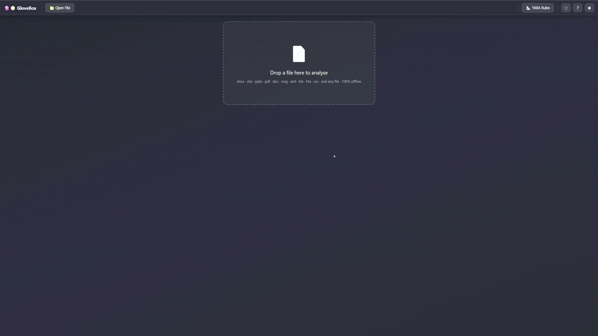

# 🧤📦 GloveBox

**A 100% offline, single-file security analyser for suspicious files.**  
No server, no uploads, no tracking — just drop a file and inspect it.

> **<a href="https://sam-dowling.github.io/GloveBox/" target="_blank">▶ Try it online here</a>**

 
<em>GloveBox — drop a file, inspect it safely, entirely in your browser.</em>

---

## 📑 Table of Contents

- [Why GloveBox?](#-why-glovebox)
- [Quick Start](#-quick-start)
- [Features](#-features)
- [In Action](#-in-action)
- [Limitations](#-limitations)
- [Security Model](#-security-model)
- [Browser Compatibility](#-browser-compatibility)
- [Get Involved](#-get-involved)

---

## 🤔 Why GloveBox?

SOC analysts, incident responders, and security-conscious users need a way to safely inspect suspicious files without uploading them to third-party services or spinning up a sandbox. GloveBox runs entirely in your browser — **nothing ever leaves your machine**.

- **Zero network access** — a strict Content-Security-Policy blocks all external fetches.
- **Single HTML file** — no install, no dependencies, works on any OS with a modern browser.
- **Broad format coverage** — Office documents, PDFs, emails, archives, images, scripts, and more.

---

## 🚀 Quick Start

[⬇️ **Download latest glovebox.html**](https://github.com/Sam-Dowling/GloveBox/releases/latest/download/glovebox.html)

> `build.py` generates `docs/index.html` — the complete, ready-to-use application served by GitHub Pages (see [CONTRIBUTING.md](CONTRIBUTING.md) for rebuild instructions).

1. **Download** — grab `glovebox.html` from the release link above, or clone the repo and open `docs/index.html`.
2. **Open** — double-click the file or open it in any modern browser (Chrome, Firefox, Edge, Safari). No server needed.
3. **Drop a file** — drag a suspicious file onto the drop zone, click **📁 Open File**, or paste with **Ctrl+V**.
4. **Inspect** — the file renders in the viewer. Press **S** to toggle the security sidebar with risk assessment, IOCs, and YARA matches. Press **Y** to open the YARA rule editor. Use **🌙** to switch themes.

---

## 🛡 Features

### Supported Formats

| Category | Extensions |
|---|---|
| **Office (modern)** | `.docx` `.docm` `.xlsx` `.xlsm` `.pptx` `.pptm` `.ods` |
| **Office (legacy)** | `.doc` `.xls` `.ppt` |
| **OpenDocument** | `.odt` (text) · `.odp` (presentation) |
| **RTF** | `.rtf` — text extraction + OLE/exploit analysis |
| **PDF** | `.pdf` |
| **Email** | `.eml` `.msg` |
| **HTML** | `.html` `.htm` `.mht` — sandboxed preview + source view |
| **Archives** | `.zip` `.gz` `.tar` `.tar.gz`/`.tgz` `.rar` `.7z` `.cab` — content listing, threat flagging, clickable entry extraction, gzip decompression, TAR parsing, ZipCrypto decryption, hex dump fallback for unsupported formats |
| **Disk images** | `.iso` `.img` — ISO 9660 filesystem listing |
| **OneNote** | `.one` — embedded object extraction + phishing detection |
| **Windows** | `.lnk` (Shell Link) · `.hta` (HTML Application) · `.url` `.webloc` (Internet shortcuts) · `.reg` (Registry) · `.inf` (Setup Information) · `.sct` (Script Component) · `.msi` (Installer) · `.exe` `.dll` `.sys` `.scr` `.cpl` `.ocx` `.drv` (PE executables) |
| **Linux / IoT** | ELF binaries (`.so` shared libraries, `.o` object files, extensionless executables) — ELF32/ELF64, LE/BE |
| **macOS** | Mach-O binaries (`.dylib` dynamic libraries, `.bundle` plugins, extensionless executables, Fat/Universal) — 32/64-bit |
| **Certificates** | `.pem` `.der` `.crt` `.cer` (X.509 certificates) · `.p12` `.pfx` (PKCS#12 containers) |
| **Java** | `.jar` `.war` `.ear` (Java archives) · `.class` (Java bytecode) — MANIFEST.MF parsing, class file analysis, constant pool string extraction, dependency analysis |
| **Scripts** | `.wsf` `.wsc` `.wsh` (Windows Script Files — parsed) · `.vbs` `.ps1` `.bat` `.cmd` `.js` |
| **Forensics** | `.evtx` (Windows Event Log) · `.sqlite` `.db` (SQLite — Chrome/Firefox/Edge history auto-detect) |
| **Data** | `.csv` `.tsv` · `.iqy` (Internet Query) · `.slk` (Symbolic Link) |
| **Images** | `.jpg` `.jpeg` `.png` `.gif` `.bmp` `.webp` `.ico` `.tif` `.tiff` `.avif` `.svg` — preview + steganography/polyglot detection |
| **Catch-all** | *Any file* — plain-text view with line numbers, or hex dump for binary data |

### Security Analysis

| Capability | Detail |
|---|---|
| **Risk assessment** | Colour-coded risk bar (low / medium / high / critical) with finding summary |
| **Document search** | In-toolbar search with match highlighting, match counter, and `Enter`/`Shift+Enter` navigation (`Ctrl+F` to focus) |
| **YARA rule engine** | In-browser YARA rule parser and matcher — load/edit/save `.yar` rules, scan any loaded file with text, hex, and regex string support. Ships with default detection rules that auto-scan on file load |
| **File hashes** | MD5 · SHA-1 · SHA-256 computed in-browser, with one-click VirusTotal lookup |
| **IOC extraction** | URLs, email addresses, IP addresses, file paths, and UNC paths pulled from document content and VBA source |
| **VBA / macro analysis** | Extracts and syntax-highlights VBA source; flags auto-execute entry points (`AutoOpen`, `Workbook_Open`, `Shell`, etc.) |
| **Macro download** | Download decoded VBA as `.txt`, or the raw `vbaProject.bin` for offline analysis with olevba / oledump |
| **PDF scanning** | Detects `/JavaScript`, `/OpenAction`, `/Launch`, `/EmbeddedFile`, URIs, XFA forms, and other risky operators via YARA rules |
| **EML / email analysis** | Full RFC 5322/MIME parser — headers, multipart body, attachments, SPF/DKIM/DMARC auth results, tracking pixel detection |
| **LNK inspection** | MS-SHLLINK binary parser — target path, arguments, timestamps, dangerous-command detection, UNC credential-theft patterns |
| **HTA analysis** | Script extraction, `<HTA:APPLICATION>` attribute parsing, obfuscation detection, 40+ suspicious pattern checks |
| **Script scanning** | Catch-all viewer scans `.vbs`, `.ps1`, `.bat`, `.rtf` and other script types for dangerous execution patterns + YARA matching |
| **Image analysis** | Steganography indicators, polyglot file detection, and hex header inspection for embedded payloads |
| **EVTX analysis** | Parses Windows Event Log binary format (ElfFile header, chunks, BinXml records); extracts Event ID, Level, Provider, Channel, Computer, timestamps, and EventData; flags suspicious events (4688, 4624/4625, 1102, 7045, 4104); extracts IOCs: usernames (`DOMAIN\User`), hostnames, IPs, process paths, command lines, hashes, URLs, file/UNC paths; Copy/Download as CSV |
| **SQLite / browser history** | Reads SQLite binary format (B-tree pages, schema, cell data); auto-detects Chrome/Edge/Firefox history databases; extracts URLs, titles, visit counts, timestamps; generic table browser for non-history SQLite files; Copy/Download as CSV |
| **PE / executable analysis** | Parses PE32/PE32+ (EXE, DLL, SYS, etc.) — DOS/COFF/Optional headers, section table with entropy analysis, imports with suspicious API flagging (~140 APIs across injection, anti-debug, credential theft, networking categories), exports, resources, Rich header, string extraction; security feature detection (ASLR, DEP, CFG, SEH, Authenticode); 27 YARA rules for packers (UPX, Themida, VMProtect), malware toolkits (Cobalt Strike, Mimikatz, Metasploit), and suspicious API patterns |
| **ELF / Linux binary analysis** | Parses ELF32/ELF64 (LE/BE) — ELF header, program headers (segments), section headers, dynamic linking (NEEDED libraries, SONAME, RPATH/RUNPATH), symbol tables (imported/exported with suspicious symbol flagging), note sections (.note.gnu.build-id, .note.ABI-tag); security feature detection (RELRO, Stack Canary, NX, PIE, FORTIFY_SOURCE, RPATH/RUNPATH); 17 YARA rules for Mirai botnet, cryptominers, reverse shells, LD_PRELOAD hijacking, rootkits, container escapes, and packed binaries |
| **Mach-O / macOS binary analysis** | Parses Mach-O 32/64-bit and Fat/Universal binaries — header, load commands, segments with section-level entropy, symbol tables (imported/exported with suspicious symbol flagging for ~30 macOS APIs), dynamic libraries, RPATH, code signature (CodeDirectory, entitlements, CMS), LC_BUILD_VERSION; security feature detection (PIE, NX Stack/Heap, Stack Canary, ARC, Code Signature, Hardened Runtime, Library Validation, Encrypted); 18 YARA rules for macOS stealers (Atomic, AMOS), reverse shells, RATs, privilege escalation, persistence (LaunchAgent/LoginItem), anti-debug/VM detection, and packed binaries |
| **X.509 certificate analysis** | Parses PEM/DER X.509 certificates and PKCS#12 containers — subject/issuer DN, validity period with expiry status, public key details (algorithm, key size, curve), extensions (SAN, Key Usage, Extended Key Usage, Basic Constraints, AKI/SKI, CRL Distribution Points, Authority Info Access, Certificate Policies), serial number, signature algorithm, SHA-1/SHA-256 fingerprints; flags self-signed certificates, expired/not-yet-valid, weak keys (<2048-bit RSA), weak signature algorithms (SHA-1/MD5), long validity periods, missing SAN, embedded private keys; IOC extraction from SANs, CRL/AIA URIs |
| **JAR / Java analysis** | Parses JAR/WAR/EAR archives and standalone `.class` files — Java class file header (magic, version, constant pool), MANIFEST.MF with Main-Class and permissions, class listing with package tree, dependency extraction, constant pool string analysis with ~45 suspicious Java API patterns (deserialization, JNDI, reflection, command execution, networking) mapped to MITRE ATT&CK; obfuscation detection (Allatori, ZKM, ProGuard, short-name heuristics); clickable inner file extraction; 18 YARA rules for deserialization gadgets, JNDI injection, reverse shells, RAT patterns, cryptominers, security manager bypass, and credential theft |
| **Encoded content detection** | Scans for Base64, hex, Base32 encoded blobs and compressed streams (gzip/zlib/deflate); decodes, classifies payloads (PE, script, URL list, etc.), extracts IOCs, and offers "Load for analysis" to drill into decoded content |
| **Archive drill-down** | Click entries inside ZIP/archive listings to open and analyse inner files, with Back navigation |
| **Document metadata** | Author, title, dates, revision count extracted from `docProps/core.xml` |

### User Interface

| Feature | Detail |
|---|---|
| **Midnight Glass theme** | Premium dark mode with frosted-glass panels, gradient surfaces, and cyan accent highlights |
| **Light / dark toggle** | Switch between dark and light themes with one click (🌙 / ☀) |
| **Floating zoom controls** | Zoom 50–200% via a floating control that stays out of the way |
| **Click-and-drag panning** | Grab and drag to pan around rendered documents |
| **Collapsible sidebar** | Single-pane sidebar with collapsible `
` sections: File Info, Macros, Signatures & IOCs |
| **Resizable sidebar** | Drag the sidebar edge to resize (33–50% of the viewport) |
| **Keyboard shortcuts** | `S` toggle sidebar · `Y` YARA dialog · `?`/`H` help & about · `Ctrl+F` search document · `Ctrl+V` paste file for analysis |
| **Loading overlay** | Spinner with status message while parsing large files |
| **Toast notifications** | Non-intrusive feedback for downloads, clipboard operations, and errors |

---

## 🎬 In Action

### Nested Encoding Detection — Double Base64 C2 Discovery

GloveBox automatically peels back layers of encoding to reveal hidden threats. In this demo a double Base64-encoded PowerShell download cradle is loaded — GloveBox decodes both layers, reconstructs the original command, and extracts the embedded C2 IP address as an IOC, all entirely in the browser.

### Try It Yourself

The [`examples/`](examples/) directory contains sample files for every supported format — try dropping them into GloveBox to explore:

- [`nested-double-b64-ip.txt`](examples/nested-double-b64-ip.txt) — double Base64-encoded PowerShell with hidden C2 IP (as shown in the demo above)
- [`encoded-zlib-base64.txt`](examples/encoded-zlib-base64.txt) — nested encoded content with compressed payloads
- [`example.lnk`](examples/example.lnk) — Windows shortcut with suspicious target path
- [`example.xlsm`](examples/example.xlsm) — macro-enabled Excel workbook with VBA
- [`example.evtx`](examples/example.evtx) — Windows Event Log with security events
- [`example.eml`](examples/example.eml) — email with MIME parts and headers
- [`example.hta`](examples/example.hta) — HTML Application with embedded scripts
- [`example-selfsigned.pem`](examples/example-selfsigned.pem) — self-signed X.509 certificate with suspicious SANs
- [`example-with-key.pem`](examples/example-with-key.pem) — certificate with embedded private key + weak 1024-bit RSA key

---

## ⚠️ Limitations

GloveBox is a **static-analysis triage tool** — it extracts, decodes, and displays file contents for human review but **does not execute** macros, JavaScript, scripts, or any embedded code. It is not a replacement for dynamic analysis sandboxes (e.g., Any.Run, Joe Sandbox) or full malware reverse-engineering workflows. For files that warrant deeper investigation, use GloveBox for initial triage and IOC extraction, then escalate to a dedicated sandbox or disassembly environment.

---

## 🔒 Security Model

GloveBox is designed to be safe to use on potentially malicious files:

| Layer | Protection |
|---|---|
| **No network** | CSP `default-src 'none'` — zero external requests, ever |
| **No eval** | No dynamic code execution; all parsing is structural |
| **No file system** | Browser sandbox — cannot read or write anything beyond the dropped file |
| **Sanitised rendering** | HTML content is escaped and sanitised; images use `data:` / `blob:` URLs only |
| **Sandboxed HTML** | HTML files are rendered in a heavily sandboxed iframe with scripts and network disabled |
| **Offline by design** | Works identically with Wi-Fi off or in an air-gapped environment |

---

## 🌐 Browser Compatibility

Tested and working in:

- Google Chrome / Chromium 90+
- Mozilla Firefox 90+
- Microsoft Edge 90+
- Safari 15+

Requires support for Web Crypto API (SHA-1/SHA-256), `async`/`await`, and `<canvas>`.

---

## 🤝 Get Involved

GloveBox is open source under the [GNU General Public License v3.0](LICENSE). Contributions are welcome!

- ⭐ **Star the repo** — helps others discover the project
- 🐛 **Open an issue** — bug reports, feature requests, and format support suggestions
- 🔀 **Submit a pull request** — YARA rule submissions, new format parsers, and improvements are especially welcome
- 📖 **See [CONTRIBUTING.md](CONTRIBUTING.md)** — build instructions, project structure, and architecture details for developers

The codebase is intentionally vanilla JavaScript (no frameworks, no bundlers) to keep the tool auditable and easy to understand.
